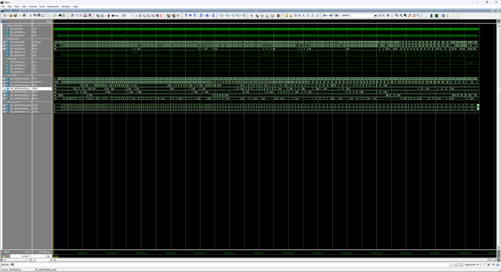

# x6502 - MOS Technology MCS6502 Verilog Implementation

<table align="center">
  <tr>
    <td align="center" style="padding: 10px;">
      
    </td>
  </tr>
</table>

## x6502 Overview

The **x6502** is a fully synchronous, instruction and bus-cycle accurate Verilog implementation of the MOS Technology NMOS 6502 8-bit microprocessor. The design is implemented as an explicit per-cycle finite state machine without microcode, providing a functional equivalent of the original NMOS silicon for FPGA-based applications.

### Features

<small>

- **Fully Synchronous Design**: All state changes occur on the positive edge of `clk` when `cen` is active. No latches or asynchronous logic.
- **Cycle-Accurate Timing**: Instruction timing matches the MOS Technology MCS6500 Hardware Manual specifications, including page-cross penalties and read-modify-write dummy cycles.
- **Bus-Cycle Accurate**: Every read, write, dummy access, stack push, and vector fetch appears on the external bus on exactly the cycle specified by the MCS6500 Hardware Manual. Per-cycle bus contents (`addr`, `dout`, `rw_n`, `sync`, `vp_n`) are explicitly verified by the testbench, not just final register state.
- **Complete Instruction Set**: All 151 documented NMOS opcodes implemented across 13 addressing modes.
- **Authentic NMOS Behaviour**: JMP indirect page-wrap bug, BCD support via the D flag, NMI edge-triggering, IRQ level-sensing gated by the I flag.
- **Vector Pull Output**: Dedicated `vp_n` strobe asserts low only during the two vector-fetch cycles of an IRQ / NMI / BRK sequence, allowing host logic to identify and acknowledge interrupts without external address decoding.
- **RDY Stall Support**: `rdy` halts the CPU on read cycles per the MCS6500 manual; write cycles complete regardless so external logic cannot lose a pending write.
- **Per-Cycle State Machine**: Each FSM state corresponds to one bus cycle; outputs are registered so each state sets the bus signals presented on the next cycle.

</small>

## Table of Contents

| # | Section | Description |
|---|---------|-------------|
| 1 | [System Architecture](#system-architecture) | Top-level block diagram of the CPU, ALU, and external bus interface |
| 2 | [Module Hierarchy](#module-hierarchy) | Source-file listing with each module's role and approximate line count |
| 3 | [Memory Map](#memory-map) | Architectural fixed addresses: zero page, stack page, and the NMI / Reset / IRQ-BRK vectors |
| 4 | [Register Set](#register-set) | Programmer-visible registers (A / X / Y / PC / S / P) and the processor-status flag layout |
| 5 | [Instruction Set](#instruction-set) | Thirteen addressing modes, per-group cycle-timing tables (load / store / RMW / branch / stack / jump / interrupt), and the full annotated NMOS 6502 opcode map |
| 6 | [Control Interface](#control-interface) | Verilog port-level reference: external bus, interrupts, clock, reset, and RDY |
| 7 | [Design Usage](#design-usage) | Instantiation template, bus signal timing rules, and interrupt handling priority and B-bit semantics |
| 8 | [6502 Family Roadmap](#6502-family-roadmap) | Position of x6502 in the planned 6502 / R65C02 / HuC6280 IP family |
| 9 | [Project Structure](#project-structure) | Directory tree of the IP package |
| 10 | [Design Verification](#design-verification) | Testbench section breakdown, run command, ModelSim screenshot, and final summary box. Per-test log: [tb_x6502](doc/readme/tb_x6502_log.md). |
| 11 | [Design References](#design-references) | Hardware manual used as the implementation reference |
| 12 | [License](#license) | Creative Commons Attribution-NonCommercial 4.0 International |
| 13 | [Support](#support) | Back ongoing Coin-Op Collection FPGA core development on Patreon |

## System Architecture

```
┌─────────────────────────────────────────────────────────────────┐
│                                x6502                            │
│  ┌───────────────────────────────────────────────────────────┐  │
│  │                                                           │  │
│  │   ┌──────────────────────┐         ┌──────────────────┐   │  │
│  │   │   x6502 (CPU)        │ <-----> │    x6502_alu     │   │  │
│  │   │                      │         │                  │   │  │
│  │   │  16-bit PC           │         │ OR,  AND, EOR    │   │  │
│  │   │   8-bit A            │         │ ADC, SBC, CMP    │   │  │
│  │   │   8-bit X            │         │ ASL, LSR, ROL    │   │  │
│  │   │   8-bit Y            │         │ ROR, BIT         │   │  │
│  │   │   8-bit S ($01)      │         │ INC, DEC         │   │  │
│  │   │   8-bit P (NV-BDIZC) │         │ EQ1, EQ2         │   │  │
│  │   │                      │         │                  │   │  │
│  │   │  Per-cycle FSM       │         │ Binary + BCD     │   │  │
│  │   └────────┬─────────────┘         └──────────────────┘   │  │
│  │            │                                              │  │
│  │            v                                              │  │
│  │     ┌──────────────────────────────────────────────┐      │  │
│  │     │           External Bus Interface             │      │  │
│  │     │                                              │      │  │
│  │     │  addr[15:0], din[7:0], dout[7:0], rw_n, sync │      │  │
│  │     │     irq_n, nmi_n, so_n, rdy, rst_n, vp_n     │      │  │
│  │     └──────────────────────────────────────────────┘      │  │
│  │                                                           │  │
│  └───────────────────────────────────────────────────────────┘  │
└─────────────────────────────────────────────────────────────────┘
```

## Module Hierarchy

| Module | Description | Lines |
|--------|-------------|-------|
| `x6502.v` | CPU state machine, instruction decode, register file | ~2200 |
| `x6502_alu.v` | Combinational arithmetic logic unit (binary + BCD) | ~300 |

## Memory Map

The x6502 is a CPU only and does not include internal memory. The host system supplies all memory and peripheral mapping. The CPU enforces the following architectural fixed addresses:

```
$0000-$00FF   Zero Page (architectural - faster addressing modes)
$0100-$01FF   Stack Page (S register indexes within this page)

$FFFA-$FFFB   NMI Vector (PC loaded on falling edge of nmi_n)
$FFFC-$FFFD   Reset Vector (PC loaded after rst_n release)
$FFFE-$FFFF   IRQ / BRK Vector (shared between IRQ and BRK)
```

## Register Set

| Register | Width | Description |
|----------|-------|-------------|
| A | 8-bit | Accumulator - general purpose arithmetic/logic |
| X | 8-bit | Index Register X - indexed addressing and counter |
| Y | 8-bit | Index Register Y - indexed addressing and counter |
| PC | 16-bit | Program Counter - next instruction address ($0000-$FFFF) |
| S | 8-bit | Stack Pointer - low byte of stack address (high byte = $01) |
| P | 8-bit | Processor Status Register (N V - B D I Z C) |

### Processor Status Register

```
  7   6   5   4   3   2   1   0
┌───┬───┬───┬───┬───┬───┬───┬───┐
│ N │ V │ 1 │ B │ D │ I │ Z │ C │
└───┴───┴───┴───┴───┴───┴───┴───┘
  │   │   │   │   │   │   │   └── Carry / Borrow
  │   │   │   │   │   │   └────── Zero
  │   │   │   │   │   └────────── Interrupt Mask
  │   │   │   │   └────────────── Decimal Mode (BCD)
  │   │   │   └────────────────── Break (only meaningful when pushed)
  │   │   └────────────────────── Always 1 on NMOS
  │   └────────────────────────── Overflow
  └────────────────────────────── Negative
```

## Instruction Set

### Addressing Modes

| Mode | Syntax | Bytes | Description |
|------|--------|-------|-------------|
| Implied | `NOP` | 1 | No operand; operation on internal registers |
| Accumulator | `ASL A` | 1 | Operation on A register |
| Immediate | `LDA #$nn` | 2 | Operand follows opcode |
| Zero Page | `LDA $nn` | 2 | EA = $00nn |
| Zero Page,X | `LDA $nn,X` | 2 | EA = ($00nn + X) & $00FF |
| Zero Page,Y | `LDX $nn,Y` | 2 | EA = ($00nn + Y) & $00FF |
| Absolute | `LDA $nnnn` | 3 | EA = $nnnn |
| Absolute,X | `LDA $nnnn,X` | 3 | EA = $nnnn + X |
| Absolute,Y | `LDA $nnnn,Y` | 3 | EA = $nnnn + Y |
| Indirect | `JMP ($nnnn)` | 3 | EA = mem[$nnnn] (NMOS page-wrap on high byte) |
| (Indirect,X) | `LDA ($nn,X)` | 2 | EA = mem[($nn + X) & $FF] |
| (Indirect),Y | `LDA ($nn),Y` | 2 | EA = mem[$nn] + Y |
| Relative | `BEQ $rr` | 2 | PC + 2 + signed 8-bit offset (branches only) |

### Instruction Timing

#### Load / Store / Logical / Arithmetic

| Instruction | IMM | ZP | ZP,X/Y | ABS | ABS,X/Y | (IND,X) | (IND),Y |
|-------------|-----|-----|--------|-----|---------|---------|---------|
| LDA / LDX / LDY | 2 | 3 | 4 | 4 | 4 (+1*) | 6 | 5 (+1*) |
| STA / STX / STY | - | 3 | 4 | 4 | 5 | 6 | 6 |
| ADC / SBC / AND / ORA / EOR / CMP | 2 | 3 | 4 | 4 | 4 (+1*) | 6 | 5 (+1*) |
| CPX / CPY | 2 | 3 | - | 4 | - | - | - |
| BIT | - | 3 | - | 4 | - | - | - |

*\*Add 1 cycle if the indexed effective address crosses a page boundary*

#### Read-Modify-Write Operations

| Instruction | A (acc) | ZP | ZP,X | ABS | ABS,X |
|-------------|---------|-----|------|-----|-------|
| ASL / LSR / ROL / ROR | 2 | 5 | 6 | 6 | 7 |
| INC / DEC | - | 5 | 6 | 6 | 7 |

*ABS,X read-modify-write is fixed at 7 cycles regardless of page cross.*

#### Branch Instructions

| Instruction | Cycles | Condition |
|-------------|--------|-----------|
| BPL | 2 / 3 / 4 | N = 0 |
| BMI | 2 / 3 / 4 | N = 1 |
| BVC | 2 / 3 / 4 | V = 0 |
| BVS | 2 / 3 / 4 | V = 1 |
| BCC | 2 / 3 / 4 | C = 0 |
| BCS | 2 / 3 / 4 | C = 1 |
| BNE | 2 / 3 / 4 | Z = 0 |
| BEQ | 2 / 3 / 4 | Z = 1 |

*2 cycles not taken, 3 cycles taken, 4 cycles taken with page cross.*

#### Stack and Subroutine Instructions

| Instruction | Bytes | Cycles | Description |
|-------------|-------|--------|-------------|
| PHA | 1 | 3 | Push A to stack |
| PHP | 1 | 3 | Push P to stack (with B = 1) |
| PLA | 1 | 4 | Pull A from stack |
| PLP | 1 | 4 | Pull P from stack (B forced 0, bit 5 forced 1) |
| JSR $nnnn | 3 | 6 | Push PC+2, load PC from absolute |
| RTS | 1 | 6 | Pull PC, increment, resume |

#### Jump Instructions

| Instruction | Bytes | Cycles | Description |
|-------------|-------|--------|-------------|
| JMP $nnnn | 3 | 3 | PC = $nnnn |
| JMP ($nnnn) | 3 | 5 | PC = mem[$nnnn] (NMOS page-wrap bug on high byte) |

#### Interrupt and Control Instructions

| Instruction | Bytes | Cycles | Description |
|-------------|-------|--------|-------------|
| BRK | 1 | 7 | Force interrupt: push PC+2, push P\|$10, vector $FFFE/F |
| RTI | 1 | 6 | Pull P (B clear, bit 5 set), pull PC |
| Hardware IRQ | - | 7 | Vector $FFFE/F, B clear in pushed P |
| Hardware NMI | - | 7 | Vector $FFFA/B, B clear in pushed P |
| NOP | 1 | 2 | No operation |
| Flag set/clear (CLC, SEC, CLI, SEI, CLV, CLD, SED) | 1 | 2 | Modify single flag |
| Register transfer (TAX, TAY, TXA, TYA, TSX, TXS) | 1 | 2 | Move between registers |
| Increment / decrement (INX, INY, DEX, DEY) | 1 | 2 | Modify X or Y |

### Opcode Map

```
     0    1    2    3    4    5    6    7    8    9    A    B    C    D    E    F
   ┌────┬────┬────┬────┬────┬────┬────┬────┬────┬────┬────┬────┬────┬────┬────┬────┐
 0 │BRK │ORA │ -- │ -- │ -- │ORA │ASL │ -- │PHP │ORA │ASL │ -- │ -- │ORA │ASL │ -- │
   │    │izx │    │    │    │ zp │ zp │    │    │imm │ A  │    │    │abs │abs │    │
   ├────┼────┼────┼────┼────┼────┼────┼────┼────┼────┼────┼────┼────┼────┼────┼────┤
 1 │BPL │ORA │ -- │ -- │ -- │ORA │ASL │ -- │CLC │ORA │ -- │ -- │ -- │ORA │ASL │ -- │
   │ rel│izy │    │    │    │zpx │zpx │    │    │aby │    │    │    │abx │abx │    │
   ├────┼────┼────┼────┼────┼────┼────┼────┼────┼────┼────┼────┼────┼────┼────┼────┤
 2 │JSR │AND │ -- │ -- │BIT │AND │ROL │ -- │PLP │AND │ROL │ -- │BIT │AND │ROL │ -- │
   │abs │izx │    │    │ zp │ zp │ zp │    │    │imm │ A  │    │abs │abs │abs │    │
   ├────┼────┼────┼────┼────┼────┼────┼────┼────┼────┼────┼────┼────┼────┼────┼────┤
 3 │BMI │AND │ -- │ -- │ -- │AND │ROL │ -- │SEC │AND │ -- │ -- │ -- │AND │ROL │ -- │
   │ rel│izy │    │    │    │zpx │zpx │    │    │aby │    │    │    │abx │abx │    │
   ├────┼────┼────┼────┼────┼────┼────┼────┼────┼────┼────┼────┼────┼────┼────┼────┤
 4 │RTI │EOR │ -- │ -- │ -- │EOR │LSR │ -- │PHA │EOR │LSR │ -- │JMP │EOR │LSR │ -- │
   │    │izx │    │    │    │ zp │ zp │    │    │imm │ A  │    │abs │abs │abs │    │
   ├────┼────┼────┼────┼────┼────┼────┼────┼────┼────┼────┼────┼────┼────┼────┼────┤
 5 │BVC │EOR │ -- │ -- │ -- │EOR │LSR │ -- │CLI │EOR │ -- │ -- │ -- │EOR │LSR │ -- │
   │ rel│izy │    │    │    │zpx │zpx │    │    │aby │    │    │    │abx │abx │    │
   ├────┼────┼────┼────┼────┼────┼────┼────┼────┼────┼────┼────┼────┼────┼────┼────┤
 6 │RTS │ADC │ -- │ -- │ -- │ADC │ROR │ -- │PLA │ADC │ROR │ -- │JMP │ADC │ROR │ -- │
   │    │izx │    │    │    │ zp │ zp │    │    │imm │ A  │    │ind │abs │abs │    │
   ├────┼────┼────┼────┼────┼────┼────┼────┼────┼────┼────┼────┼────┼────┼────┼────┤
 7 │BVS │ADC │ -- │ -- │ -- │ADC │ROR │ -- │SEI │ADC │ -- │ -- │ -- │ADC │ROR │ -- │
   │ rel│izy │    │    │    │zpx │zpx │    │    │aby │    │    │    │abx │abx │    │
   ├────┼────┼────┼────┼────┼────┼────┼────┼────┼────┼────┼────┼────┼────┼────┼────┤
 8 │ -- │STA │ -- │ -- │STY │STA │STX │ -- │DEY │ -- │TXA │ -- │STY │STA │STX │ -- │
   │    │izx │    │    │ zp │ zp │ zp │    │    │    │    │    │abs │abs │abs │    │
   ├────┼────┼────┼────┼────┼────┼────┼────┼────┼────┼────┼────┼────┼────┼────┼────┤
 9 │BCC │STA │ -- │ -- │STY │STA │STX │ -- │TYA │STA │TXS │ -- │ -- │STA │ -- │ -- │
   │ rel│izy │    │    │zpx │zpx │zpy │    │    │aby │    │    │    │abx │    │    │
   ├────┼────┼────┼────┼────┼────┼────┼────┼────┼────┼────┼────┼────┼────┼────┼────┤
 A │LDY │LDA │LDX │ -- │LDY │LDA │LDX │ -- │TAY │LDA │TAX │ -- │LDY │LDA │LDX │ -- │
   │imm │izx │imm │    │ zp │ zp │ zp │    │    │imm │    │    │abs │abs │abs │    │
   ├────┼────┼────┼────┼────┼────┼────┼────┼────┼────┼────┼────┼────┼────┼────┼────┤
 B │BCS │LDA │ -- │ -- │LDY │LDA │LDX │ -- │CLV │LDA │TSX │ -- │LDY │LDA │LDX │ -- │
   │ rel│izy │    │    │zpx │zpx │zpy │    │    │aby │    │    │abx │abx │aby │    │
   ├────┼────┼────┼────┼────┼────┼────┼────┼────┼────┼────┼────┼────┼────┼────┼────┤
 C │CPY │CMP │ -- │ -- │CPY │CMP │DEC │ -- │INY │CMP │DEX │ -- │CPY │CMP │DEC │ -- │
   │imm │izx │    │    │ zp │ zp │ zp │    │    │imm │    │    │abs │abs │abs │    │
   ├────┼────┼────┼────┼────┼────┼────┼────┼────┼────┼────┼────┼────┼────┼────┼────┤
 D │BNE │CMP │ -- │ -- │ -- │CMP │DEC │ -- │CLD │CMP │ -- │ -- │ -- │CMP │DEC │ -- │
   │ rel│izy │    │    │    │zpx │zpx │    │    │aby │    │    │    │abx │abx │    │
   ├────┼────┼────┼────┼────┼────┼────┼────┼────┼────┼────┼────┼────┼────┼────┼────┤
 E │CPX │SBC │ -- │ -- │CPX │SBC │INC │ -- │INX │SBC │NOP │ -- │CPX │SBC │INC │ -- │
   │imm │izx │    │    │ zp │ zp │ zp │    │    │imm │    │    │abs │abs │abs │    │
   ├────┼────┼────┼────┼────┼────┼────┼────┼────┼────┼────┼────┼────┼────┼────┼────┤
 F │BEQ │SBC │ -- │ -- │ -- │SBC │INC │ -- │SED │SBC │ -- │ -- │ -- │SBC │INC │ -- │
   │ rel│izy │    │    │    │zpx │zpx │    │    │aby │    │    │    │abx │abx │    │
   └────┴────┴────┴────┴────┴────┴────┴────┴────┴────┴────┴────┴────┴────┴────┴────┘
```

*Cells marked `--` are undocumented opcodes. Only the 151 documented NMOS instructions are implemented; undocumented opcodes execute as NOP.*

## Control Interface

### Bus Interface

```verilog
output reg  [15:0] addr, // Address bus (16-bit, registered)
input  wire  [7:0] din,  // Data input
output reg   [7:0] dout, // Data output (registered)
output reg         rw_n, // Read/Write (1 = read, 0 = write)
output reg         sync  // High during opcode fetch (T0)
```

### Interrupts

```verilog
input  wire irq_n, // IRQ - level-sensitive, gated by I flag
input  wire nmi_n, // NMI - edge-triggered, non-maskable
input  wire so_n,  // Set-Overflow - sets V flag on falling edge
output reg  vp_n   // Vector Pull - low during interrupt vector fetch (2 cycles)
```

### Clock and Reset

```verilog
input  wire clk,   // System clock
input  wire cen,   // Clock enable (one bus cycle per pulse)
input  wire rst_n, // Active-low reset
input  wire rdy    // Active-high ready (CPU stalls when low during reads)
```

## Design Usage

### Instantiation Example

```verilog
x6502 u_cpu (
    .clk   ( clk_sys  ), // System clock
    .cen   ( cpu_cen  ), // Clock enable (one bus cycle per pulse)
    .rst_n ( reset_n  ), // Active-low reset

    // Interrupt Interface
    .irq_n ( irq_n    ), // IRQ (level-sensitive, gated by I flag)
    .nmi_n ( nmi_n    ), // NMI (edge-triggered)
    .so_n  ( so_n     ), // Set-Overflow input
    .rdy   ( rdy      ), // Ready (stalls reads when low)
    .vp_n  ( vp_n     ), // Vector Pull (low during vector fetch)

    // External Bus
    .addr  ( cpu_addr ), // 16-bit address out
    .din   ( cpu_din  ), // 8-bit data in
    .dout  ( cpu_dout ), // 8-bit data out
    .rw_n  ( cpu_rw_n ), // Read/Write
    .sync  ( cpu_sync )  // High during opcode fetch
);
```

### Bus Signal Timing

Each FSM state sets `addr`, `dout`, `rw_n`, and `sync` to the values the bus must show during the **next** cycle. Inputs (`din`, `irq_n`, `nmi_n`, `so_n`, `rdy`) are sampled at the rising clock edge of the cycle they appear on the bus. The CPU advances exactly one bus cycle per `cen` pulse, allowing fractional clock divisions for cycle-accurate host integration.

### Interrupt Handling

| Source | Trigger | Vector | Push B Bit |
|--------|---------|--------|------------|
| BRK | Software (opcode $00) | $FFFE/F | 1 |
| IRQ | Level-low on `irq_n`, gated by I flag | $FFFE/F | 0 |
| NMI | Falling edge on `nmi_n` | $FFFA/B | 0 |
| Reset | Low on `rst_n` | $FFFC/D | - |

NMI is edge-triggered: the CPU latches the falling edge internally and clears the latch when the interrupt is taken. IRQ is level-sensitive and continues to assert as long as `irq_n` is held low and the I flag is clear. BRK pushes `PC+2` (skipping the byte after the opcode) and sets B = 1 in the pushed status byte.

### Vector Pull (`vp_n`)

The `vp_n` output asserts low for the two consecutive bus cycles in which the CPU reads the interrupt vector low and high bytes. This applies to all three interrupt sources (BRK, IRQ, NMI) but **not** to the reset vector fetch. Host logic can use `vp_n` as a clean strobe to acknowledge interrupt sources without decoding the vector address ranges, and to gate vectored interrupt controllers found on systems such as the WDC 65C816.

| Cycle | BRK / IRQ / NMI | Reset |
|-------|-----------------|-------|
| Vector low fetch | `vp_n = 0` | `vp_n = 1` |
| Vector high fetch | `vp_n = 0` | `vp_n = 1` |
| All other cycles | `vp_n = 1` | `vp_n = 1` |

## 6502 Family Roadmap

The x6502 NMOS core is the first release in a family of three 6502-architecture-derived cores. The R65C02 (x65c02) and HuC6280 (x6280) extend the ISA with the CMOS additions and Hudson Soft / NEC custom-chip extensions respectively.

| Feature | x6502 (Current) | x65c02 | x6280 |
|---------|-----------------|--------|-------|
| Core ISA | NMOS 6502 | CMOS R65C02 (Rockwell) | HuC6280 (Hudson Soft / NEC) |
| Documented Opcodes | 151 | 178 | 234 |
| Address Bus | 16-bit | 16-bit | 21-bit (via 8 x MPR) |
| Zero Page / Stack | $0000 / $0100 | $0000 / $0100 | $2000 / $2100 |
| BCD Mode | C flag only | Full N / V / Z / C valid | Full N / V / Z / C valid |
| JMP Indirect Page-Wrap | NMOS bug | Fixed | Fixed |
| Bit Manipulation (RMB/SMB/BBR/BBS) | - | ✓ | ✓ |
| STZ / TRB / TSB | - | ✓ | ✓ |
| BRA (relative) | - | ✓ | ✓ |
| (zp) Indirect | - | ✓ | ✓ |
| JMP (abs,X) | - | ✓ | ✓ |
| INC A / DEC A | - | ✓ | ✓ |
| PHX / PHY / PLX / PLY | - | ✓ | ✓ |
| BIT immediate / zp,X / abs,X | - | ✓ | ✓ |
| MPR (TAM / TMA) | - | - | ✓ |
| Block Transfers (TII / TDD / TIN / TIA / TAI) | - | - | ✓ |
| VDC Port Writes (ST0 / ST1 / ST2) | - | - | ✓ |
| TST #imm,addr / BSR / SET (T-flag) | - | - | ✓ |
| CLA / CLX / CLY / SXY / SAX / SAY | - | - | ✓ |
| CSL / CSH (clock speed flag) | - | - | ✓ |
| Multi-Vector IRQ ($FFF6 IRQ2 / $FFF8 IRQ1 / $FFFA Timer / $FFFE BRK) | - | - | ✓ |

## Project Structure

```
x6502/
├── hdl/
│   ├── x6502.v          # CPU state machine and instruction decoder
│   └── x6502_alu.v      # Arithmetic logic unit
├── sim/
│   └── tb_x6502.v       # Comprehensive testbench
└── x6502.qip            # Quartus project include file
```

## Design Verification

The testbench (`tb_x6502.v`) provides comprehensive verification across 36 sections:

<small>

- **Instruction Coverage**: All 151 documented NMOS opcodes across 13 addressing modes
- **Cycle Timing**: Verified against MCS6500 Hardware Manual specifications
- **Flag Behavior**: N, V, B, D, I, Z, C tested per instruction with BCD edge cases
- **Interrupt Handling**: BRK / IRQ / NMI with vector fetch and B-bit semantics
- **NMOS Bugs**: JMP indirect page-wrap behaviour explicitly verified
- **Page Crossing**: Indexed addressing read penalties and fixed write timing
- **ALU Direct**: Sections 25-34 drive a standalone ALU instance for BCD nibble adjust, EQ1/EQ2 pass-through, CMP carry-in forcing, and BIT corner cases
- **Vector Pull**: Section 35 verifies `vp_n` asserts low only during BRK / IRQ / NMI vector fetch cycles and remains high during reset vector fetch
- **RDY Stall**: Section 36 verifies `rdy = 0` halts the CPU on read cycles, allows write cycles to complete, and resumes cleanly when `rdy` returns high

</small>

```
vlog hdl/x6502_alu.v hdl/x6502.v sim/tb_x6502.v
vsim -c tb_x6502 -do "run -all"
```

<table align="center">
  <tr>
    <td align="center" style="padding: 10px;">
      
    </td>
  </tr>
</table>

```
=============================================================
  x6502 Test Results
=============================================================
  Total Tests:  564
  Passed:       564
  Failed:       0
=============================================================
  *** ALL TESTS PASSED ***
  Cycle-accurate to MCS6500 Hardware Manual
=============================================================
```

Per-test output: [tb_x6502](doc/readme/tb_x6502_log.md)

## Design References

- MOS Technology MCS6500 Microcomputer Family Hardware Manual, January 1976

## License

This work is licensed under the Creative Commons Attribution-NonCommercial 4.0 International License (CC BY-NC 4.0). You may use, share, and modify this code for non-commercial purposes, provided that proper credit is given. To view a copy of this license, visit **http://creativecommons.org/licenses/by-nc/4.0/**.

## Support

Please consider supporting this and future projects by joining the [**Coin-Op Collection Patreon**](https://www.patreon.com/atrac17).

---
