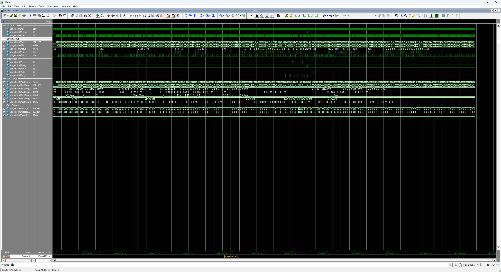

# x65c02 - Rockwell R65C02 Verilog Implementation

<table align="center">
  <tr>
    <td align="center" style="padding: 10px;">
      
    </td>
  </tr>
</table>

## x65c02 Overview

The **x65c02** is a fully synchronous, instruction and bus-cycle accurate Verilog implementation of the Rockwell R65C02 8-bit CMOS microprocessor. The design is implemented as an explicit per-cycle finite state machine without microcode, providing a functional equivalent of the original CMOS silicon for FPGA-based applications. The R65C02 is the Rockwell variant of the 6502 family, extending the NMOS 6502 instruction set with CMOS additions and the Rockwell bit-manipulation group (RMB / SMB / BBR / BBS).

### Features

<small>

- **Fully Synchronous Design**: All state changes occur on the positive edge of `clk` when `cen` is active. No latches or asynchronous logic.
- **Instruction-Cycle Accurate**: Instruction cycle counts match the Rockwell R65C02 datasheet, including page-cross penalties, read-modify-write dummy cycles, and the additional internal cycles introduced by the CMOS variant.
- **Bus-Cycle Accurate**: Every read, write, dummy access, stack push, and vector fetch appears on the external bus on exactly the cycle specified by the R65C02 datasheet. Per-cycle bus contents (`addr`, `dout`, `rw_n`, `sync`, `vp_n`) are explicitly verified by the testbench, not just final register state.
- **Complete CMOS Instruction Set**: All 178 documented R65C02 opcodes implemented across 16 addressing modes, including the 27 CMOS additions over the NMOS 6502.
- **Rockwell Bit Manipulation**: RMB0-7, SMB0-7, BBR0-7, BBS0-7 - 32 single-bit zero-page operations encoded in the opcode high nibble.
- **CMOS Bug Fixes**: JMP indirect page-wrap bug fixed; BCD ADC / SBC produce valid N, V, Z flags; ABS,X read no longer issues a spurious read across page boundaries.
- **Vector Pull Output**: Dedicated `vp_n` strobe asserts low only during the two vector-fetch cycles of an IRQ / NMI / BRK sequence, allowing host logic to identify and acknowledge interrupts without external address decoding.
- **RDY Stall Support**: `rdy` halts the CPU on read cycles per the R65C02 datasheet; write cycles complete regardless so external logic cannot lose a pending write.
- **Per-Cycle State Machine**: Each FSM state corresponds to one bus cycle; outputs are registered so each state sets the bus signals presented on the next cycle.

</small>

## Table of Contents

| # | Section | Description |
|---|---------|-------------|
| 1 | [System Architecture](#system-architecture) | Top-level block diagram of the CPU, ALU, and external bus interface |
| 2 | [Module Hierarchy](#module-hierarchy) | Source-file listing with each module's role and approximate line count |
| 3 | [Memory Map](#memory-map) | Architectural fixed addresses: zero page, stack page, and the NMI / Reset / IRQ-BRK vectors |
| 4 | [Register Set](#register-set) | Programmer-visible registers (A / X / Y / PC / S / P) and the processor-status flag layout |
| 5 | [Instruction Set](#instruction-set) | Sixteen addressing modes, per-group cycle-timing tables (load / store / RMW / branch / stack / jump / Rockwell bit / CMOS / interrupt), and the full annotated R65C02 opcode map with the 27 CMOS additions |
| 6 | [Control Interface](#control-interface) | Verilog port-level reference: external bus, interrupts, clock, reset, RDY, and the vector-pull output |
| 7 | [Design Usage](#design-usage) | Instantiation template, bus signal timing rules, interrupt handling priority and B-bit semantics, and the `vp_n` vector-pull strobe |
| 8 | [CMOS-Specific Behaviour](#cmos-specific-behaviour) | Detailed notes on every R65C02 extension over the NMOS 6502: JMP page-wrap fix, BCD flag fix, BRA, Rockwell bit-manipulation group, STZ / TRB / TSB, stack extensions, INC A / DEC A, (zp) indirect, JMP (abs,X) |
| 9 | [6502 Family Roadmap](#6502-family-roadmap) | Position of x65c02 in the planned 6502 / R65C02 / HuC6280 IP family |
| 10 | [Project Structure](#project-structure) | Directory tree of the IP package |
| 11 | [Design Verification](#design-verification) | Testbench section breakdown, run command, ModelSim screenshot, and final summary box. Per-test log: [tb_x65c02](doc/readme/tb_x65c02_log.md). |
| 12 | [Design References](#design-references) | Hardware manuals and datasheets used as the implementation reference |
| 13 | [License](#license) | Creative Commons Attribution-NonCommercial 4.0 International |
| 14 | [Support](#support) | Back ongoing Coin-Op Collection FPGA core development on Patreon |

## System Architecture

```
┌─────────────────────────────────────────────────────────────────┐
│                               x65c02                            │
│  ┌───────────────────────────────────────────────────────────┐  │
│  │                                                           │  │
│  │   ┌──────────────────────┐         ┌──────────────────┐   │  │
│  │   │   x65c02 (CPU)       │ <-----> │    x65c02_alu    │   │  │
│  │   │                      │         │                  │   │  │
│  │   │  16-bit PC           │         │ OR,  AND, EOR    │   │  │
│  │   │   8-bit A            │         │ ADC, SBC, CMP    │   │  │
│  │   │   8-bit X            │         │ ASL, LSR, ROL    │   │  │
│  │   │   8-bit Y            │         │ ROR, BIT         │   │  │
│  │   │   8-bit S ($01)      │         │ INC, DEC         │   │  │
│  │   │   8-bit P (NV-BDIZC) │         │ EQ1, EQ2         │   │  │
│  │   │                      │         │                  │   │  │
│  │   │  Per-cycle FSM       │         │ Binary + BCD     │   │  │
│  │   │  178 CMOS opcodes    │         │ (CMOS N/V/Z fix) │   │  │
│  │   └────────┬─────────────┘         └──────────────────┘   │  │
│  │            │                                              │  │
│  │            v                                              │  │
│  │     ┌──────────────────────────────────────────────┐      │  │
│  │     │           External Bus Interface             │      │  │
│  │     │                                              │      │  │
│  │     │  addr[15:0], din[7:0], dout[7:0], rw_n, sync │      │  │
│  │     │     irq_n, nmi_n, so_n, rdy, rst_n, vp_n     │      │  │
│  │     └──────────────────────────────────────────────┘      │  │
│  │                                                           │  │
│  └───────────────────────────────────────────────────────────┘  │
└─────────────────────────────────────────────────────────────────┘
```

## Module Hierarchy

| Module | Description | Lines |
|--------|-------------|-------|
| `x65c02.v` | CPU state machine, instruction decode, register file | ~2400 |
| `x65c02_alu.v` | Combinational arithmetic logic unit (binary + BCD with CMOS flag fix) | ~310 |

## Memory Map

The x65c02 is a CPU only and does not include internal memory. The host system supplies all memory and peripheral mapping. The CPU enforces the following architectural fixed addresses:

```
$0000-$00FF   Zero Page (architectural - faster addressing modes)
$0100-$01FF   Stack Page (S register indexes within this page)

$FFFA-$FFFB   NMI Vector (PC loaded on falling edge of nmi_n)
$FFFC-$FFFD   Reset Vector (PC loaded after rst_n release)
$FFFE-$FFFF   IRQ / BRK Vector (shared between IRQ and BRK)
```

## Register Set

| Register | Width | Description |
|----------|-------|-------------|
| A | 8-bit | Accumulator - general purpose arithmetic/logic |
| X | 8-bit | Index Register X - indexed addressing and counter |
| Y | 8-bit | Index Register Y - indexed addressing and counter |
| PC | 16-bit | Program Counter - next instruction address ($0000-$FFFF) |
| S | 8-bit | Stack Pointer - low byte of stack address (high byte = $01) |
| P | 8-bit | Processor Status Register (N V - B D I Z C) |

### Processor Status Register

```
  7   6   5   4   3   2   1   0
┌───┬───┬───┬───┬───┬───┬───┬───┐
│ N │ V │ 1 │ B │ D │ I │ Z │ C │
└───┴───┴───┴───┴───┴───┴───┴───┘
  │   │   │   │   │   │   │   └── Carry / Borrow
  │   │   │   │   │   │   └────── Zero
  │   │   │   │   │   └────────── Interrupt Mask
  │   │   │   │   └────────────── Decimal Mode (BCD)
  │   │   │   └────────────────── Break (only meaningful when pushed)
  │   │   └────────────────────── Always 1
  │   └────────────────────────── Overflow
  └────────────────────────────── Negative
```

On the R65C02, the N, V, and Z flags are valid following ADC and SBC in decimal mode (D = 1) - on the NMOS 6502 only C was guaranteed valid in decimal mode. The CMOS variant adds an internal correction cycle to ADC / SBC in decimal mode to compute these flags.

## Instruction Set

### Addressing Modes

| Mode | Syntax | Bytes | Description |
|------|--------|-------|-------------|
| Implied | `NOP` | 1 | No operand; operation on internal registers |
| Accumulator | `ASL A` | 1 | Operation on A register |
| Immediate | `LDA #$nn` | 2 | Operand follows opcode |
| Zero Page | `LDA $nn` | 2 | EA = $00nn |
| Zero Page,X | `LDA $nn,X` | 2 | EA = ($00nn + X) & $00FF |
| Zero Page,Y | `LDX $nn,Y` | 2 | EA = ($00nn + Y) & $00FF |
| Absolute | `LDA $nnnn` | 3 | EA = $nnnn |
| Absolute,X | `LDA $nnnn,X` | 3 | EA = $nnnn + X |
| Absolute,Y | `LDA $nnnn,Y` | 3 | EA = $nnnn + Y |
| Indirect | `JMP ($nnnn)` | 3 | EA = mem[$nnnn] (CMOS - no page-wrap, full 16-bit increment) |
| (Indirect,X) | `LDA ($nn,X)` | 2 | EA = mem[($nn + X) & $FF] |
| (Indirect),Y | `LDA ($nn),Y` | 2 | EA = mem[$nn] + Y |
| (Indirect) | `LDA ($nn)` | 2 | EA = mem[$nn] (CMOS-only, no index) |
| (Absolute,X) | `JMP ($nnnn,X)` | 3 | EA = mem[($nnnn + X)] (CMOS-only) |
| Relative | `BEQ $rr` | 2 | PC + 2 + signed 8-bit offset (branches only) |
| Zero Page,Relative | `BBR0 $nn,$rr` | 3 | Test bit n of $nn; PC + 3 + signed offset (BBR/BBS only) |

### Instruction Timing

#### Load / Store / Logical / Arithmetic

| Instruction | IMM | ZP | ZP,X/Y | ABS | ABS,X/Y | (IND,X) | (IND),Y | (IND) |
|-------------|-----|-----|--------|-----|---------|---------|---------|-------|
| LDA / LDX / LDY | 2 | 3 | 4 | 4 | 4 (+1*) | 6 | 5 (+1*) | 5 |
| STA / STX / STY | - | 3 | 4 | 4 | 5 | 6 | 6 | 5 |
| ADC / SBC / AND / ORA / EOR / CMP | 2 | 3 | 4 | 4 | 4 (+1*) | 6 | 5 (+1*) | 5 |
| CPX / CPY | 2 | 3 | - | 4 | - | - | - | - |
| BIT | 2 | 3 | 4 | 4 | 4 (+1*) | - | - | - |

*\*Add 1 cycle if the indexed effective address crosses a page boundary*

#### Read-Modify-Write Operations

| Instruction | A (acc) | ZP | ZP,X | ABS | ABS,X |
|-------------|---------|-----|------|-----|-------|
| ASL / LSR / ROL / ROR | 2 | 5 | 6 | 6 | 7 |
| INC / DEC | 2 (CMOS) | 5 | 6 | 6 | 7 |
| TRB / TSB | - | 5 | - | 6 | - |

*ABS,X read-modify-write is fixed at 7 cycles regardless of page cross. INC A and DEC A are CMOS-only accumulator-mode RMW additions.*

#### Branch Instructions

| Instruction | Cycles | Condition |
|-------------|--------|-----------|
| BPL | 2 / 3 / 4 | N = 0 |
| BMI | 2 / 3 / 4 | N = 1 |
| BVC | 2 / 3 / 4 | V = 0 |
| BVS | 2 / 3 / 4 | V = 1 |
| BCC | 2 / 3 / 4 | C = 0 |
| BCS | 2 / 3 / 4 | C = 1 |
| BNE | 2 / 3 / 4 | Z = 0 |
| BEQ | 2 / 3 / 4 | Z = 1 |
| BRA | 3 / 4 | Always taken (CMOS) |
| BBR0-7 | 5 / 6 / 7 | Branch if zp bit n = 0 |
| BBS0-7 | 5 / 6 / 7 | Branch if zp bit n = 1 |

*Conditional branches: 2 not taken, 3 taken, 4 with page cross. BRA: 3 no-cross, 4 with cross. BBR/BBS: 5 not taken, 6 taken, 7 with page cross.*

#### Stack and Subroutine Instructions

| Instruction | Bytes | Cycles | Description |
|-------------|-------|--------|-------------|
| PHA | 1 | 3 | Push A to stack |
| PHP | 1 | 3 | Push P to stack (with B = 1) |
| PHX | 1 | 3 | Push X to stack (CMOS) |
| PHY | 1 | 3 | Push Y to stack (CMOS) |
| PLA | 1 | 4 | Pull A from stack |
| PLP | 1 | 4 | Pull P from stack (B forced 0, bit 5 forced 1) |
| PLX | 1 | 4 | Pull X from stack, update N/Z (CMOS) |
| PLY | 1 | 4 | Pull Y from stack, update N/Z (CMOS) |
| JSR $nnnn | 3 | 6 | Push PC+2, load PC from absolute |
| RTS | 1 | 6 | Pull PC, increment, resume |

#### Jump Instructions

| Instruction | Bytes | Cycles | Description |
|-------------|-------|--------|-------------|
| JMP $nnnn | 3 | 3 | PC = $nnnn |
| JMP ($nnnn) | 3 | 6 | PC = mem[$nnnn] (CMOS - 6 cycles, no page-wrap bug) |
| JMP ($nnnn,X) | 3 | 6 | PC = mem[$nnnn + X] (CMOS-only) |

#### Bit Manipulation (Rockwell)

| Instruction | Bytes | Cycles | Description |
|-------------|-------|--------|-------------|
| RMB0 - RMB7 $nn | 2 | 5 | Clear bit n of zero-page byte |
| SMB0 - SMB7 $nn | 2 | 5 | Set bit n of zero-page byte |
| BBR0 - BBR7 $nn,$rr | 3 | 5 / 6 / 7 | Branch if bit n of zp byte is clear |
| BBS0 - BBS7 $nn,$rr | 3 | 5 / 6 / 7 | Branch if bit n of zp byte is set |

#### CMOS-Specific Memory Operations

| Instruction | Bytes | Cycles | Description |
|-------------|-------|--------|-------------|
| STZ $nn | 2 | 3 | Store $00 to zero page |
| STZ $nn,X | 2 | 4 | Store $00 to zero page,X |
| STZ $nnnn | 3 | 4 | Store $00 to absolute |
| STZ $nnnn,X | 3 | 5 | Store $00 to absolute,X (fixed, no cross penalty) |
| TRB $nn | 2 | 5 | Test and reset bits in zp using A as mask |
| TRB $nnnn | 3 | 6 | Test and reset bits in absolute using A as mask |
| TSB $nn | 2 | 5 | Test and set bits in zp using A as mask |
| TSB $nnnn | 3 | 6 | Test and set bits in absolute using A as mask |

#### Interrupt and Control Instructions

| Instruction | Bytes | Cycles | Description |
|-------------|-------|--------|-------------|
| BRK | 1 | 7 | Force interrupt: push PC+2, push P\|$10, vector $FFFE/F |
| RTI | 1 | 6 | Pull P (B clear, bit 5 set), pull PC |
| Hardware IRQ | - | 7 | Vector $FFFE/F, B clear in pushed P |
| Hardware NMI | - | 7 | Vector $FFFA/B, B clear in pushed P |
| NOP | 1 | 2 | No operation |
| Flag set/clear (CLC, SEC, CLI, SEI, CLV, CLD, SED) | 1 | 2 | Modify single flag |
| Register transfer (TAX, TAY, TXA, TYA, TSX, TXS) | 1 | 2 | Move between registers |
| Increment / decrement (INX, INY, DEX, DEY, INC A, DEC A) | 1 | 2 | Modify X, Y, or A |

### CMOS Additions over NMOS 6502

The R65C02 adds 27 documented opcodes over the 151 documented NMOS instructions, bringing the total to 178:

| Group | Opcodes | Description |
|-------|---------|-------------|
| New addressing mode | 8'h12, 32, 52, 72, 92, B2, D2, F2 | (zp) indirect for ORA/AND/EOR/ADC/STA/LDA/CMP/SBC |
| Indexed indirect jump | 8'h7C | JMP ($nnnn,X) |
| Always-take branch | 8'h80 | BRA $rr |
| Accumulator INC/DEC | 8'h1A, 3A | INC A / DEC A |
| Stack push/pull (X/Y) | 8'h5A, 7A, DA, FA | PHY / PLY / PHX / PLX |
| Store zero | 8'h64, 74, 9C, 9E | STZ zp / zp,X / abs / abs,X |
| Test and reset bits | 8'h14, 1C | TRB zp / abs |
| Test and set bits | 8'h04, 0C | TSB zp / abs |
| BIT extensions | 8'h89, 34, 3C | BIT # / BIT zp,X / BIT abs,X |
| Reset memory bit | 8'h07, 17, 27, 37, 47, 57, 67, 77 | RMB0-7 zp |
| Set memory bit | 8'h87, 97, A7, B7, C7, D7, E7, F7 | SMB0-7 zp |
| Branch on bit reset | 8'h0F, 1F, 2F, 3F, 4F, 5F, 6F, 7F | BBR0-7 zp,rel |
| Branch on bit set | 8'h8F, 9F, AF, BF, CF, DF, EF, FF | BBS0-7 zp,rel |

### Opcode Map

```
     0    1    2    3    4    5    6    7    8    9    A    B    C    D    E    F
   ┌────┬────┬────┬────┬────┬────┬────┬────┬────┬────┬────┬────┬────┬────┬────┬────┐
 0 │BRK │ORA │ -- │ -- │TSB │ORA │ASL │RMB0│PHP │ORA │ASL │ -- │TSB │ORA │ASL │BBR0│
   │    │izx │    │    │ zp │ zp │ zp │ zp │    │imm │ A  │    │abs │abs │abs │zprl│
   ├────┼────┼────┼────┼────┼────┼────┼────┼────┼────┼────┼────┼────┼────┼────┼────┤
 1 │BPL │ORA │ORA │ -- │TRB │ORA │ASL │RMB1│CLC │ORA │INC │ -- │TRB │ORA │ASL │BBR1│
   │ rel│izy │izp │    │ zp │zpx │zpx │ zp │    │aby │ A  │    │abs │abx │abx │zprl│
   ├────┼────┼────┼────┼────┼────┼────┼────┼────┼────┼────┼────┼────┼────┼────┼────┤
 2 │JSR │AND │ -- │ -- │BIT │AND │ROL │RMB2│PLP │AND │ROL │ -- │BIT │AND │ROL │BBR2│
   │abs │izx │    │    │ zp │ zp │ zp │ zp │    │imm │ A  │    │abs │abs │abs │zprl│
   ├────┼────┼────┼────┼────┼────┼────┼────┼────┼────┼────┼────┼────┼────┼────┼────┤
 3 │BMI │AND │AND │ -- │BIT │AND │ROL │RMB3│SEC │AND │DEC │ -- │BIT │AND │ROL │BBR3│
   │ rel│izy │izp │    │zpx │zpx │zpx │ zp │    │aby │ A  │    │abx │abx │abx │zprl│
   ├────┼────┼────┼────┼────┼────┼────┼────┼────┼────┼────┼────┼────┼────┼────┼────┤
 4 │RTI │EOR │ -- │ -- │ -- │EOR │LSR │RMB4│PHA │EOR │LSR │ -- │JMP │EOR │LSR │BBR4│
   │    │izx │    │    │    │ zp │ zp │ zp │    │imm │ A  │    │abs │abs │abs │zprl│
   ├────┼────┼────┼────┼────┼────┼────┼────┼────┼────┼────┼────┼────┼────┼────┼────┤
 5 │BVC │EOR │EOR │ -- │ -- │EOR │LSR │RMB5│CLI │EOR │PHY │ -- │ -- │EOR │LSR │BBR5│
   │ rel│izy │izp │    │    │zpx │zpx │ zp │    │aby │    │    │    │abx │abx │zprl│
   ├────┼────┼────┼────┼────┼────┼────┼────┼────┼────┼────┼────┼────┼────┼────┼────┤
 6 │RTS │ADC │ -- │ -- │STZ │ADC │ROR │RMB6│PLA │ADC │ROR │ -- │JMP │ADC │ROR │BBR6│
   │    │izx │    │    │ zp │ zp │ zp │ zp │    │imm │ A  │    │ind │abs │abs │zprl│
   ├────┼────┼────┼────┼────┼────┼────┼────┼────┼────┼────┼────┼────┼────┼────┼────┤
 7 │BVS │ADC │ADC │ -- │STZ │ADC │ROR │RMB7│SEI │ADC │PLY │ -- │JMP │ADC │ROR │BBR7│
   │ rel│izy │izp │    │zpx │zpx │zpx │ zp │    │aby │    │    │iax │abx │abx │zprl│
   ├────┼────┼────┼────┼────┼────┼────┼────┼────┼────┼────┼────┼────┼────┼────┼────┤
 8 │BRA │STA │ -- │ -- │STY │STA │STX │SMB0│DEY │BIT │TXA │ -- │STY │STA │STX │BBS0│
   │ rel│izx │    │    │ zp │ zp │ zp │ zp │    │imm │    │    │abs │abs │abs │zprl│
   ├────┼────┼────┼────┼────┼────┼────┼────┼────┼────┼────┼────┼────┼────┼────┼────┤
 9 │BCC │STA │STA │ -- │STY │STA │STX │SMB1│TYA │STA │TXS │ -- │STZ │STA │STZ │BBS1│
   │ rel│izy │izp │    │zpx │zpx │zpy │ zp │    │aby │    │    │abs │abx │abx │zprl│
   ├────┼────┼────┼────┼────┼────┼────┼────┼────┼────┼────┼────┼────┼────┼────┼────┤
 A │LDY │LDA │LDX │ -- │LDY │LDA │LDX │SMB2│TAY │LDA │TAX │ -- │LDY │LDA │LDX │BBS2│
   │imm │izx │imm │    │ zp │ zp │ zp │ zp │    │imm │    │    │abs │abs │abs │zprl│
   ├────┼────┼────┼────┼────┼────┼────┼────┼────┼────┼────┼────┼────┼────┼────┼────┤
 B │BCS │LDA │LDA │ -- │LDY │LDA │LDX │SMB3│CLV │LDA │TSX │ -- │LDY │LDA │LDX │BBS3│
   │ rel│izy │izp │    │zpx │zpx │zpy │ zp │    │aby │    │    │abx │abx │aby │zprl│
   ├────┼────┼────┼────┼────┼────┼────┼────┼────┼────┼────┼────┼────┼────┼────┼────┤
 C │CPY │CMP │ -- │ -- │CPY │CMP │DEC │SMB4│INY │CMP │DEX │ -- │CPY │CMP │DEC │BBS4│
   │imm │izx │    │    │ zp │ zp │ zp │ zp │    │imm │    │    │abs │abs │abs │zprl│
   ├────┼────┼────┼────┼────┼────┼────┼────┼────┼────┼────┼────┼────┼────┼────┼────┤
 D │BNE │CMP │CMP │ -- │ -- │CMP │DEC │SMB5│CLD │CMP │PHX │ -- │ -- │CMP │DEC │BBS5│
   │ rel│izy │izp │    │    │zpx │zpx │ zp │    │aby │    │    │    │abx │abx │zprl│
   ├────┼────┼────┼────┼────┼────┼────┼────┼────┼────┼────┼────┼────┼────┼────┼────┤
 E │CPX │SBC │ -- │ -- │CPX │SBC │INC │SMB6│INX │SBC │NOP │ -- │CPX │SBC │INC │BBS6│
   │imm │izx │    │    │ zp │ zp │ zp │ zp │    │imm │    │    │abs │abs │abs │zprl│
   ├────┼────┼────┼────┼────┼────┼────┼────┼────┼────┼────┼────┼────┼────┼────┼────┤
 F │BEQ │SBC │SBC │ -- │ -- │SBC │INC │SMB7│SED │SBC │PLX │ -- │ -- │SBC │INC │BBS7│
   │ rel│izy │izp │    │    │zpx │zpx │ zp │    │aby │    │    │    │abx │abx │zprl│
   └────┴────┴────┴────┴────┴────┴────┴────┴────┴────┴────┴────┴────┴────┴────┴────┘
```

*Cells marked `--` are unused on the R65C02 (reserved or NOP). Only the 178 documented R65C02 instructions are implemented; unused opcodes execute as NOP. Addressing-mode keys: `izp` = (zp) indirect, `iax` = (abs,X) indirect, `zprl` = zero-page,relative (BBR/BBS), all others as on the NMOS 6502.*

## Control Interface

### Bus Interface

```verilog
output reg  [15:0] addr, // Address bus (16-bit, registered)
input  wire  [7:0] din,  // Data input
output reg   [7:0] dout, // Data output (registered)
output reg         rw_n, // Read/Write (1 = read, 0 = write)
output reg         sync  // High during opcode fetch (T0)
```

### Interrupts

```verilog
input  wire irq_n, // IRQ - level-sensitive, gated by I flag
input  wire nmi_n, // NMI - edge-triggered, non-maskable
input  wire so_n,  // Set-Overflow - sets V flag on falling edge
output reg  vp_n   // Vector Pull - low during interrupt vector fetch (2 cycles)
```

### Clock and Reset

```verilog
input  wire clk,   // System clock
input  wire cen,   // Clock enable (one bus cycle per pulse)
input  wire rst_n, // Active-low reset
input  wire rdy    // Active-high ready (CPU stalls when low during reads)
```

## Design Usage

### Instantiation Example

```verilog
x65c02 u_cpu (
    .clk   ( clk_sys  ), // System clock
    .cen   ( cpu_cen  ), // Clock enable (one bus cycle per pulse)
    .rst_n ( reset_n  ), // Active-low reset

    // Interrupt Interface
    .irq_n ( irq_n    ), // IRQ (level-sensitive, gated by I flag)
    .nmi_n ( nmi_n    ), // NMI (edge-triggered)
    .so_n  ( so_n     ), // Set-Overflow input
    .rdy   ( rdy      ), // Ready (stalls reads when low)
    .vp_n  ( vp_n     ), // Vector Pull (low during vector fetch)

    // External Bus
    .addr  ( cpu_addr ), // 16-bit address out
    .din   ( cpu_din  ), // 8-bit data in
    .dout  ( cpu_dout ), // 8-bit data out
    .rw_n  ( cpu_rw_n ), // Read/Write
    .sync  ( cpu_sync )  // High during opcode fetch
);
```

### Bus Signal Timing

Each FSM state sets `addr`, `dout`, `rw_n`, and `sync` to the values the bus must show during the **next** cycle. Inputs (`din`, `irq_n`, `nmi_n`, `so_n`, `rdy`) are sampled at the rising clock edge of the cycle they appear on the bus. The CPU advances exactly one bus cycle per `cen` pulse, allowing fractional clock divisions for cycle-accurate host integration.

### Interrupt Handling

| Source | Trigger | Vector | Push B Bit |
|--------|---------|--------|------------|
| BRK | Software (opcode $00) | $FFFE/F | 1 |
| IRQ | Level-low on `irq_n`, gated by I flag | $FFFE/F | 0 |
| NMI | Falling edge on `nmi_n` | $FFFA/B | 0 |
| Reset | Low on `rst_n` | $FFFC/D | - |

NMI is edge-triggered: the CPU latches the falling edge internally and clears the latch when the interrupt is taken. IRQ is level-sensitive and continues to assert as long as `irq_n` is held low and the I flag is clear. BRK pushes `PC+2` (skipping the byte after the opcode) and sets B = 1 in the pushed status byte.

The R65C02 also clears the D flag automatically on entry to BRK / IRQ / NMI - this prevents spurious BCD arithmetic in interrupt handlers and matches the documented CMOS behaviour.

### Vector Pull (`vp_n`)

The `vp_n` output asserts low for the two consecutive bus cycles in which the CPU reads the interrupt vector low and high bytes. This applies to all three interrupt sources (BRK, IRQ, NMI) but **not** to the reset vector fetch. Host logic can use `vp_n` as a clean strobe to acknowledge interrupt sources without decoding the vector address ranges, and to gate vectored interrupt controllers found on systems such as the WDC 65C816.

| Cycle | BRK / IRQ / NMI | Reset |
|-------|-----------------|-------|
| Vector low fetch | `vp_n = 0` | `vp_n = 1` |
| Vector high fetch | `vp_n = 0` | `vp_n = 1` |
| All other cycles | `vp_n = 1` | `vp_n = 1` |

## CMOS-Specific Behaviour

The sections below describe the documented behavioural differences between the R65C02 and the NMOS 6502, all of which are implemented by this core.

<details>
<summary><h3>JMP Indirect Page-Wrap Fix</h3></summary>

On the NMOS 6502, `JMP ($xxFF)` reads the high byte of the target from `$xx00` (high byte of pointer wraps within the same page). The R65C02 fixes this so the high byte is read from `$(xx+1)00`, with a full 16-bit pointer increment. The CMOS variant adds one internal cycle to JMP indirect (5 -> 6 cycles total).

</details>

<details>
<summary><h3>BCD ADC / SBC Flag Fix</h3></summary>

On the NMOS 6502, after ADC or SBC in decimal mode (D = 1), only the C flag is valid - N, V, and Z reflect the binary intermediate result, not the decimal result. The R65C02 produces correct N, V, Z flags for the decimal result. The CMOS variant adds one internal correction cycle per BCD ADC / SBC.

</details>

<details>
<summary><h3>Decimal Mode on Interrupt Entry</h3></summary>

The R65C02 forces D = 0 on entry to any interrupt handler (BRK / IRQ / NMI) to prevent stale BCD state from corrupting interrupt arithmetic. The original D value is preserved on the stack as part of the pushed P byte and restored by RTI / PLP.

</details>

<details>
<summary><h3>Always-Take Branch (BRA)</h3></summary>

`BRA $rr` ($80) is taken unconditionally, like an unconditional jump but with a signed 8-bit relative offset and 3 / 4 cycle timing (no-cross / cross). It executes regardless of any flag.

</details>

<details>
<summary><h3>Bit-Manipulation Group (Rockwell)</h3></summary>

The Rockwell-flavoured R65C02 adds 32 bit-level zero-page operations:
- **RMBn $nn**: Clear bit n of the byte at zero-page address $nn (5 cycles, no flags affected).
- **SMBn $nn**: Set bit n of the byte at zero-page address $nn (5 cycles, no flags affected).
- **BBRn $nn,$rr**: Branch by signed offset if bit n of byte at $nn is 0 (5 / 6 / 7 cycles).
- **BBSn $nn,$rr**: Branch by signed offset if bit n of byte at $nn is 1 (5 / 6 / 7 cycles).

The bit number n (0-7) is encoded in the opcode high nibble (`ir[6:4]`), and the operation type is encoded in the second-highest nibble (`ir[7]` = 0 for RMB / BBR, 1 for SMB / BBS).

</details>

<details>
<summary><h3>CMOS Memory Operations</h3></summary>

- **STZ**: Store $00 to memory in zp / zp,X / abs / abs,X.
- **TRB**: Test-and-reset - clears the bits in memory that are set in A (`M = M AND NOT A`); Z = `(M AND A) == 0`.
- **TSB**: Test-and-set - sets the bits in memory that are set in A (`M = M OR A`); Z = `(M AND A) == 0` (uses pre-write M).

</details>

<details>
<summary><h3>CMOS Stack Extensions</h3></summary>

- **PHX / PHY** push X / Y to the stack (3 cycles each).
- **PLX / PLY** pull X / Y from the stack and update N / Z flags (4 cycles each).

</details>

<details>
<summary><h3>Accumulator INC / DEC</h3></summary>

- **INC A** ($1A) and **DEC A** ($3A) operate on the accumulator in 2 cycles, updating N and Z.

</details>

<details>
<summary><h3>(zp) Indirect Addressing Mode</h3></summary>

The R65C02 adds the bare (zp) indirect mode - effective address is read from a zero-page pointer with 8-bit ZP wrap on the pointer increment. Available for ORA, AND, EOR, ADC, STA, LDA, CMP, SBC (5 cycles each).

</details>

<details>
<summary><h3>JMP (abs,X) Addressing Mode</h3></summary>

`JMP ($nnnn,X)` ($7C) computes the indirect pointer as base + X with full 16-bit arithmetic, then reads the target from that pointer with full 16-bit pointer increment. 6 cycles.

</details>

## 6502 Family Roadmap

The x65c02 R65C02 core is the second release in a family of three 6502-architecture-derived cores, sitting between the x6502 NMOS core and the x6280 HuC6280 core. It introduces the CMOS additions inherited by the HuC6280.

| Feature | x6502 | x65c02 (Current) | x6280 |
|---------|-------|------------------|-------|
| Core ISA | NMOS 6502 | CMOS R65C02 (Rockwell) | HuC6280 (Hudson Soft / NEC) |
| Documented Opcodes | 151 | 178 | 234 |
| Address Bus | 16-bit | 16-bit | 21-bit (via 8 x MPR) |
| Zero Page / Stack | $0000 / $0100 | $0000 / $0100 | $2000 / $2100 |
| BCD Mode | C flag only | Full N / V / Z / C valid | Full N / V / Z / C valid |
| JMP Indirect Page-Wrap | NMOS bug | Fixed | Fixed |
| Bit Manipulation (RMB/SMB/BBR/BBS) | - | ✓ | ✓ |
| STZ / TRB / TSB | - | ✓ | ✓ |
| BRA (relative) | - | ✓ | ✓ |
| (zp) Indirect | - | ✓ | ✓ |
| JMP (abs,X) | - | ✓ | ✓ |
| INC A / DEC A | - | ✓ | ✓ |
| PHX / PHY / PLX / PLY | - | ✓ | ✓ |
| BIT immediate / zp,X / abs,X | - | ✓ | ✓ |
| MPR (TAM / TMA) | - | - | ✓ |
| Block Transfers (TII / TDD / TIN / TIA / TAI) | - | - | ✓ |
| VDC Port Writes (ST0 / ST1 / ST2) | - | - | ✓ |
| TST #imm,addr / BSR / SET (T-flag) | - | - | ✓ |
| CLA / CLX / CLY / SXY / SAX / SAY | - | - | ✓ |
| CSL / CSH (clock speed flag) | - | - | ✓ |
| Multi-Vector IRQ ($FFF6 IRQ2 / $FFF8 IRQ1 / $FFFA Timer / $FFFE BRK) | - | - | ✓ |

## Project Structure

```
x65c02/
├── doc/
│   ├── 00_MOS_Technology_MCS6500_Hardware_Manual_Jan1976.pdf
│   └── 01_Rockwell_R65C02_R65C102_R65C112_CPU_Datasheet_Rev6_Jun1987.pdf
├── hdl/
│   ├── x65c02.v          # CPU state machine and instruction decoder
│   └── x65c02_alu.v      # Arithmetic logic unit (binary + BCD with CMOS flag fix)
├── sim/
│   └── tb_x65c02.v       # Comprehensive testbench (47 sections, 727 tests)
└── x65c02.qip            # Quartus project include file
```

## Design Verification

The testbench (`tb_x65c02.v`) provides comprehensive verification across 47 sections covering all NMOS-equivalent functionality plus every CMOS extension:

<small>

- **Instruction Coverage**: All 178 documented R65C02 opcodes across 16 addressing modes
- **Cycle Timing**: Verified against Rockwell R65C02 datasheet specifications, including the extra internal cycles introduced by JMP indirect, BCD ADC / SBC, JMP (abs,X), and BBR / BBS
- **Flag Behavior**: N, V, B, D, I, Z, C tested per instruction including the CMOS BCD N / V / Z fix
- **Interrupt Handling**: BRK / IRQ / NMI with vector fetch and B-bit semantics
- **CMOS Bug Fixes**: JMP indirect page-wrap fix and BCD flag fix explicitly verified against the NMOS-buggy reference behaviour
- **Page Crossing**: Indexed addressing read penalties and fixed write timing
- **ALU Direct**: Sections 25-34 drive a standalone ALU instance for BCD nibble adjust, EQ1 / EQ2 pass-through, CMP carry-in forcing, and BIT corner cases
- **Vector Pull**: Section 35 verifies `vp_n` asserts low only during BRK / IRQ / NMI vector fetch cycles and remains high during reset vector fetch
- **RDY Stall**: Section 36 verifies `rdy = 0` halts the CPU on read cycles, allows write cycles to complete, and resumes cleanly when `rdy` returns high
- **CMOS Sections (37-47)**: BRA always-take with page cross, INC A / DEC A, PHX / PHY / PLX / PLY, STZ in all four addressing modes, TRB / TSB zp / abs, BIT # / zp,X / abs,X, JMP (abs,X) with page-cross fix, (zp) indirect for all 8 op-classes plus ZP wrap, RMB0-7 / SMB0-7 sweep, BBR0-7 / BBS0-7 sweep, BCD N / V / Z fix verification

</small>

```
vlog hdl/x65c02_alu.v hdl/x65c02.v sim/tb_x65c02.v
vsim -c tb_x65c02 -do "run -all"
```

<table align="center">
  <tr>
    <td align="center" style="padding: 10px;">
      
    </td>
  </tr>
</table>

```
=============================================================
  x65c02 Test Results
=============================================================
  Total Tests:  727
  Passed:       727
  Failed:       0
=============================================================
  *** ALL TESTS PASSED ***
  Cycle-accurate to Rockwell R65C02 Datasheet
=============================================================
```

Per-test output: [tb_x65c02](doc/readme/tb_x65c02_log.md)

## Design References

- MOS Technology MCS6500 Microcomputer Family Hardware Manual, January 1976
- Rockwell R65C02 / R65C102 / R65C112 CMOS Microprocessor Datasheet, Revision 6, June 1987

## License

This work is licensed under the Creative Commons Attribution-NonCommercial 4.0 International License (CC BY-NC 4.0). You may use, share, and modify this code for non-commercial purposes, provided that proper credit is given. To view a copy of this license, visit **http://creativecommons.org/licenses/by-nc/4.0/**.

## Support

Please consider supporting this and future projects by joining the [**Coin-Op Collection Patreon**](https://www.patreon.com/atrac17).

---
