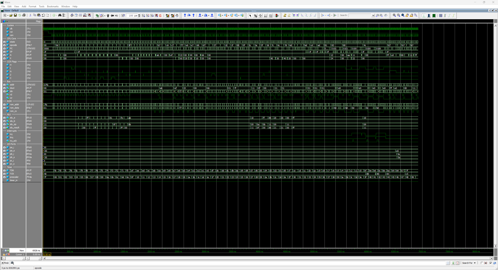

# x68705 - MC68705P3 Verilog Implementation

<table align="center">
  <tr>
    <td align="center" style="padding: 10px;">
      
    </td>
  </tr>
</table>

## x68705 Overview

The **x68705** is a fully synchronous, cycle-accurate Verilog implementation of the Motorola MC68705P3 8-bit EPROM microcomputer unit. Built on the M6805 family core architecture, this implementation provides a functional equivalent of the MC68705P3 for FPGA-based applications.

### Features

<small>

- **Fully Synchronous Design**: All state changes occur on the positive edge of `clk` when `cen` is active. No latches or asynchronous logic.
- **Cycle-Accurate Timing**: Instruction timing matches M6805 CMOS Family User's Manual specifications.
- **Complete Instruction Set**: All 62 unique operations (202 valid opcodes) implemented across 10 addressing modes.
- **Integrated Peripherals**: I/O ports, timer/counter, and internal RAM included.
- **M6805 Family Compatible**: Core architecture shared across the M6805 family.

</small>

## Table of Contents

| # | Section | Description |
|---|---------|-------------|
| 1 | [System Architecture](#system-architecture) | Top-level block diagram of the MCU, CPU core, ALU, internal RAM, I/O ports, and timer |
| 2 | [Module Hierarchy](#module-hierarchy) | Source-file listing with each module's role and approximate line count |
| 3 | [Memory Map](#memory-map) | Address layout: I/O registers, internal RAM, EPROM, and interrupt vectors |
| 4 | [Register Set](#register-set) | Programmer-visible registers (A / X / PC / SP / CCR) and the condition-code flag layout |
| 5 | [Instruction Set](#instruction-set) | Ten addressing modes, per-group cycle-timing tables, and the full annotated MC68705P3 opcode map |
| 6 | [Control Interface](#control-interface) | Verilog port-level reference: I/O ports A / B / C, IRQ, timer input, and the ROM bus |
| 7 | [Control Registers](#control-registers) | Timer Control Register (TCR) and Mask Option Register (MOR) bit-field layouts |
| 8 | [Design Usage](#design-usage) | Instantiation template, bus signal timing rules, and interrupt handling priority |
| 9 | [M6805 Family Roadmap](#m6805-family-roadmap) | Position of x68705 in the planned M6805 family IP set |
| 10 | [Project Structure](#project-structure) | Directory tree of the IP package |
| 11 | [Design Verification](#design-verification) | Testbench section breakdown, run command, ModelSim screenshot, and final summary box. Per-test log: [tb_x68705](doc/readme/tb_x68705_log.md). |
| 12 | [Design References](#design-references) | Hardware manuals and datasheets used as the implementation reference |
| 13 | [License](#license) | Creative Commons Attribution-NonCommercial 4.0 International |
| 14 | [Support](#support) | Back ongoing Coin-Op Collection FPGA core development on Patreon |

## System Architecture

```
┌─────────────────────────────────────────────────────────────────┐
│                         x68705_mcu                              │
│  ┌───────────────────────────────────────────────────────────┐  │
│  │                        x68705                             │  │
│  │                                                           │  │
│  │   ┌──────────┐    ┌──────────┐    ┌──────────────────┐    │  │
│  │   │  x6805   │<-->│x6805_alu │    │    x68705_mem    │    │  │
│  │   │          │    │          │    │  (112B RAM +     │    │  │
│  │   │ 11-bit PC│    │ ADD, SUB │    │  Address Decode) │    │  │
│  │   │  6-bit SP│    │ AND, ORA │    └────────┬─────────┘    │  │
│  │   │  8-bit A │    │ EOR, COM │             │              │  │
│  │   │  8-bit X │    │ Shifts   │             v              │  │
│  │   │  5-bit CC│    │ Rotates  │    ┌──────────────────┐    │  │
│  │   └────┬─────┘    └──────────┘    │   x68705_io      │    │  │
│  │        │                          │  Port A (8-bit)  │    │  │
│  │        v                          │  Port B (8-bit)  │    │  │
│  │   ┌──────────┐                    │  Port C (4-bit)  │    │  │
│  │   │x68705    │                    └──────────────────┘    │  │
│  │   │_timer    │                                            │  │
│  │   │ 8-bit TDR│    ┌────────────────────────────────────┐  │  │
│  │   │ 7-bit PSC│    │      External ROM Interface        │  │  │
│  │   └──────────┘    │    (1804B User + 115B Bootstrap)   │  │  │
│  │                   └────────────────────────────────────┘  │  │
│  └───────────────────────────────────────────────────────────┘  │
└─────────────────────────────────────────────────────────────────┘
```

## Module Hierarchy

| Module | Description | Lines |
|--------|-------------|-------|
| `x68705_mcu.v` | Top-level MCU wrapper with MOR handling | ~135 |
| `x68705.v` | Core integration (CPU, ALU, Memory, I/O, Timer) | ~245 |
| `x6805.v` | Central processor with state machine | ~2050 |
| `x6805_alu.v` | Combinational arithmetic logic unit | ~272 |
| `x68705_io.v` | Parallel I/O ports with DDRs | ~158 |
| `x68705_timer.v` | 8-bit timer with 7-bit prescaler | ~245 |
| `x68705_mem.v` | Address decoder and 112-byte RAM | ~162 |

## Memory Map

```
$000-$007   I/O Registers
  $000      Port A Data Register (read/write)
  $001      Port B Data Register (read/write)
  $002      Port C Data Register (bits 3:0, upper bits read as 1)
  $003      Reserved (reads as $FF)
  $004      Port A DDR (write-only, reads as $FF)
  $005      Port B DDR (write-only, reads as $FF)
  $006      Port C DDR (bits 3:0, write-only)
  $007      Reserved (reads as $FF)

$008-$009   Timer Registers
  $008      TDR - Timer Data Register (8-bit counter)
  $009      TCR - Timer Control Register

$00A-$00F   Reserved (reads as $FF)

$010-$07F   Internal RAM (112 bytes)
  $010-$05F   General purpose (80 bytes)
  $060-$07F   Stack area (32 bytes, builds downward)

$080-$783   User EPROM (1804 bytes)
$784        Mask Option Register (MOR)
$785-$7F7   Bootstrap ROM (115 bytes)

$7F8-$7FF   Interrupt Vectors
  $7F8-$7F9   Timer Interrupt Vector
  $7FA-$7FB   External Interrupt Vector
  $7FC-$7FD   Software Interrupt Vector
  $7FE-$7FF   Reset Vector
```

## Register Set

| Register | Width | Description |
|----------|-------|-------------|
| A | 8-bit | Accumulator - general purpose arithmetic/logic |
| X | 8-bit | Index Register - indexed addressing and temporary storage |
| PC | 11-bit | Program Counter - next instruction address ($000-$7FF) |
| SP | 6-bit | Stack Pointer - maps to $40-$7F (reset: $3F → $7F) |
| CCR | 5-bit | Condition Code Register (H, I, N, Z, C) |

### Condition Code Register

```
  7   6   5   4   3   2   1   0
┌───┬───┬───┬───┬───┬───┬───┬───┐
│ 1 │ 1 │ 1 │ H │ I │ N │ Z │ C │
└───┴───┴───┴───┴───┴───┴───┴───┘
              │   │   │   │   └── Carry/Borrow
              │   │   │   └────── Zero
              │   │   └────────── Negative
              │   └────────────── Interrupt Mask
              └────────────────── Half Carry
```

## Instruction Set

### Addressing Modes

| Mode | Syntax | Bytes | Description |
|------|--------|-------|-------------|
| Inherent | `INCA` | 1 | Operation on internal registers |
| Immediate | `LDA #$nn` | 2 | Operand follows opcode |
| Direct | `LDA $nn` | 2 | 8-bit address in page zero |
| Extended | `LDA $nnnn` | 3 | 16-bit absolute address |
| Indexed | `LDA ,X` | 1 | EA = X |
| Indexed+8 | `LDA $nn,X` | 2 | EA = X + 8-bit offset |
| Indexed+16 | `LDA $nnnn,X` | 3 | EA = X + 16-bit offset |
| Relative | `BEQ $rr` | 2 | PC + 2 + signed offset |
| Bit Set/Clear | `BSET 0,$nn` | 2 | Direct address + bit number |
| Bit Test/Branch | `BRSET 0,$nn,$rr` | 3 | Direct + bit + relative |

### Instruction Timing

#### Register/Memory Operations

| Instruction | IMM | DIR | EXT | IX | IX1 | IX2 |
|-------------|-----|-----|-----|-----|-----|-----|
| LDA/LDX | 2 | 3 | 4 | 3 | 4 | 5 |
| STA/STX | - | 4 | 5 | 4 | 5 | 6 |
| ADD/ADC/SUB/SBC | 2 | 3 | 4 | 3 | 4 | 5 |
| AND/ORA/EOR/BIT | 2 | 3 | 4 | 3 | 4 | 5 |
| CMP/CPX | 2 | 3 | 4 | 3 | 4 | 5 |

#### Read-Modify-Write Operations

| Instruction | INH(A) | INH(X) | DIR | IX | IX1 |
|-------------|--------|--------|-----|-----|-----|
| INC/DEC | 3 | 3 | 5 | 5 | 6 |
| NEG/COM/CLR | 3 | 3 | 5 | 5 | 6 |
| LSR/ASR/LSL | 3 | 3 | 5 | 5 | 6 |
| ROL/ROR | 3 | 3 | 5 | 5 | 6 |
| TST | 3 | 3 | 4 | 4 | 5 |

#### Branch Instructions

| Instruction | Cycles | Condition |
|-------------|--------|-----------|
| BRA | 3 | Always |
| BRN | 3 | Never |
| BHI | 3 | C=0 AND Z=0 |
| BLS | 3 | C=1 OR Z=1 |
| BCC/BHS | 3 | C=0 |
| BCS/BLO | 3 | C=1 |
| BNE | 3 | Z=0 |
| BEQ | 3 | Z=1 |
| BHCC | 3 | H=0 |
| BHCS | 3 | H=1 |
| BPL | 3 | N=0 |
| BMI | 3 | N=1 |
| BMC | 3 | I=0 |
| BMS | 3 | I=1 |
| BIL | 3 | IRQ line low |
| BIH | 3 | IRQ line high |

#### Bit Manipulation Instructions

| Instruction | Bytes | Cycles | Description |
|-------------|-------|--------|-------------|
| BSET n,$dd | 2 | 5 | Set bit n in direct memory |
| BCLR n,$dd | 2 | 5 | Clear bit n in direct memory |
| BRSET n,$dd,$rr | 3 | 5 | Branch if bit n set |
| BRCLR n,$dd,$rr | 3 | 5 | Branch if bit n clear |

#### Control Instructions

| Instruction | Bytes | Cycles | Description |
|-------------|-------|--------|-------------|
| NOP | 1 | 2 | No operation |
| TAX | 1 | 2 | Transfer A to X |
| TXA | 1 | 2 | Transfer X to A |
| CLC | 1 | 2 | Clear carry |
| SEC | 1 | 2 | Set carry |
| CLI | 1 | 2 | Clear interrupt mask |
| SEI | 1 | 2 | Set interrupt mask |
| RSP | 1 | 2 | Reset stack pointer |
| STOP | 1 | 2 | Stop oscillator |
| WAIT | 1 | 2 | Wait for interrupt |

*STOP and WAIT are M146805 CMOS instructions, implemented here for M6805 family compatibility.*

#### Jump and Subroutine Instructions

| Instruction | DIR | EXT | IX | IX1 | IX2 |
|-------------|-----|-----|-----|-----|-----|
| JMP | 2 | 3 | 2 | 3 | 4 |
| JSR | 5 | 6 | 5 | 6 | 7 |
| BSR (relative) | 6 | - | - | - | - |
| RTS | 6 | - | - | - | - |

#### Interrupt Instructions

| Instruction | Cycles | Description |
|-------------|--------|-------------|
| SWI | 10 | Software interrupt |
| RTI | 9 | Return from interrupt |
| Hardware IRQ | 10 | External/Timer interrupt |

### Opcode Map

```
     0    1    2    3    4    5    6    7    8    9    A    B    C    D    E    F
   ┌────┬────┬────┬────┬────┬────┬────┬────┬────┬────┬────┬────┬────┬────┬────┬────┐
 0 │BRSE│BRSE│BRSE│BRSE│BRSE│BRSE│BRSE│BRSE│BRCL│BRCL│BRCL│BRCL│BRCL│BRCL│BRCL│BRCL│
   │T 0 │T 1 │T 2 │T 3 │T 4 │T 5 │T 6 │T 7 │R 0 │R 1 │R 2 │R 3 │R 4 │R 5 │R 6 │R 7 │
   ├────┼────┼────┼────┼────┼────┼────┼────┼────┼────┼────┼────┼────┼────┼────┼────┤
 1 │BSET│BSET│BSET│BSET│BSET│BSET│BSET│BSET│BCLR│BCLR│BCLR│BCLR│BCLR│BCLR│BCLR│BCLR│
   │ 0  │ 1  │ 2  │ 3  │ 4  │ 5  │ 6  │ 7  │ 0  │ 1  │ 2  │ 3  │ 4  │ 5  │ 6  │ 7  │
   ├────┼────┼────┼────┼────┼────┼────┼────┼────┼────┼────┼────┼────┼────┼────┼────┤
 2 │BRA │BRN │BHI │BLS │BCC │BCS │BNE │BEQ │BHCC│BHCS│BPL │BMI │BMC │BMS │BIL │BIH │
   ├────┼────┼────┼────┼────┼────┼────┼────┼────┼────┼────┼────┼────┼────┼────┼────┤
 3 │NEG │ -- │ -- │COM │LSR │ -- │ROR │ASR │LSL │ROL │DEC │ -- │INC │TST │ -- │CLR │
   │dir │    │    │dir │dir │    │dir │dir │dir │dir │dir │    │dir │dir │    │dir │
   ├────┼────┼────┼────┼────┼────┼────┼────┼────┼────┼────┼────┼────┼────┼────┼────┤
 4 │NEGA│ -- │MUL*│COMA│LSRA│ -- │RORA│ASRA│LSLA│ROLA│DECA│ -- │INCA│TSTA│ -- │CLRA│
   ├────┼────┼────┼────┼────┼────┼────┼────┼────┼────┼────┼────┼────┼────┼────┼────┤
 5 │NEGX│ -- │ -- │COMX│LSRX│ -- │RORX│ASRX│LSLX│ROLX│DECX│ -- │INCX│TSTX│ -- │CLRX│
   ├────┼────┼────┼────┼────┼────┼────┼────┼────┼────┼────┼────┼────┼────┼────┼────┤
 6 │NEG │ -- │ -- │COM │LSR │ -- │ROR │ASR │LSL │ROL │DEC │ -- │INC │TST │ -- │CLR │
   │ix1 │    │    │ix1 │ix1 │    │ix1 │ix1 │ix1 │ix1 │ix1 │    │ix1 │ix1 │    │ix1 │
   ├────┼────┼────┼────┼────┼────┼────┼────┼────┼────┼────┼────┼────┼────┼────┼────┤
 7 │NEG │ -- │ -- │COM │LSR │ -- │ROR │ASR │LSL │ROL │DEC │ -- │INC │TST │ -- │CLR │
   │ ix │    │    │ ix │ ix │    │ ix │ ix │ ix │ ix │ ix │    │ ix │ ix │    │ ix │
   ├────┼────┼────┼────┼────┼────┼────┼────┼────┼────┼────┼────┼────┼────┼────┼────┤
 8 │RTI │RTS │ -- │SWI │ -- │ -- │ -- │ -- │ -- │ -- │ -- │ -- │ -- │ -- │STOP│WAIT│
   ├────┼────┼────┼────┼────┼────┼────┼────┼────┼────┼────┼────┼────┼────┼────┼────┤
 9 │ -- │ -- │ -- │ -- │ -- │ -- │ -- │TAX │CLC │SEC │CLI │SEI │RSP │NOP │ -- │TXA │
   ├────┼────┼────┼────┼────┼────┼────┼────┼────┼────┼────┼────┼────┼────┼────┼────┤
 A │SUB │CMP │SBC │CPX │AND │BIT │LDA │ -- │EOR │ADC │ORA │ADD │ -- │BSR │LDX │ -- │
   │imm │imm │imm │imm │imm │imm │imm │    │imm │imm │imm │imm │    │rel │imm │    │
   ├────┼────┼────┼────┼────┼────┼────┼────┼────┼────┼────┼────┼────┼────┼────┼────┤
 B │SUB │CMP │SBC │CPX │AND │BIT │LDA │STA │EOR │ADC │ORA │ADD │JMP │JSR │LDX │STX │
   │dir │dir │dir │dir │dir │dir │dir │dir │dir │dir │dir │dir │dir │dir │dir │dir │
   ├────┼────┼────┼────┼────┼────┼────┼────┼────┼────┼────┼────┼────┼────┼────┼────┤
 C │SUB │CMP │SBC │CPX │AND │BIT │LDA │STA │EOR │ADC │ORA │ADD │JMP │JSR │LDX │STX │
   │ext │ext │ext │ext │ext │ext │ext │ext │ext │ext │ext │ext │ext │ext │ext │ext │
   ├────┼────┼────┼────┼────┼────┼────┼────┼────┼────┼────┼────┼────┼────┼────┼────┤
 D │SUB │CMP │SBC │CPX │AND │BIT │LDA │STA │EOR │ADC │ORA │ADD │JMP │JSR │LDX │STX │
   │ix2 │ix2 │ix2 │ix2 │ix2 │ix2 │ix2 │ix2 │ix2 │ix2 │ix2 │ix2 │ix2 │ix2 │ix2 │ix2 │
   ├────┼────┼────┼────┼────┼────┼────┼────┼────┼────┼────┼────┼────┼────┼────┼────┤
 E │SUB │CMP │SBC │CPX │AND │BIT │LDA │STA │EOR │ADC │ORA │ADD │JMP │JSR │LDX │STX │
   │ix1 │ix1 │ix1 │ix1 │ix1 │ix1 │ix1 │ix1 │ix1 │ix1 │ix1 │ix1 │ix1 │ix1 │ix1 │ix1 │
   ├────┼────┼────┼────┼────┼────┼────┼────┼────┼────┼────┼────┼────┼────┼────┼────┤
 F │SUB │CMP │SBC │CPX │AND │BIT │LDA │STA │EOR │ADC │ORA │ADD │JMP │JSR │LDX │STX │
   │ ix │ ix │ ix │ ix │ ix │ ix │ ix │ ix │ ix │ ix │ ix │ ix │ ix │ ix │ ix │ ix │
   └────┴────┴────┴────┴────┴────┴────┴────┴────┴────┴────┴────┴────┴────┴────┴────┘
```

*MUL ($42) is available only on HC05 variants, not implemented in MC68705P3*

## Control Interface

### I/O Ports

```verilog
// Port A - 8-bit bidirectional with internal pull-ups
input  wire [7:0] pa_i, // Port A external input
output wire [7:0] pa_o, // Port A output

// Port B - 8-bit bidirectional, true high-Z
input  wire [7:0] pb_i, // Port B external input
output wire [7:0] pb_o, // Port B output

// Port C - 4-bit bidirectional, true high-Z
input  wire [3:0] pc_i, // Port C external input
output wire [3:0] pc_o  // Port C output
```

### Interrupts

```verilog
input  wire irq,    // External interrupt request (active high)
output wire irq_ack // Pulsed interrupt acknowledge
```

### Timer

```verilog
input  wire timer_in // External timer clock input
```

### ROM

```verilog
output wire [10:0] rom_addr, // 2KB address space
input  wire  [7:0] rom_data, // ROM data input
output wire        rom_cs    // ROM chip select
```

## Control Registers

### Timer Control Register (TCR)

```
  7   6   5   4   3   2   1   0
┌───┬───┬───┬───┬───┬───┬───┬───┐
│TIR│TIM│TIN│TIE│PSC│PS2│PS1│PS0│
└───┴───┴───┴───┴───┴───┴───┴───┘
  │   │   │   │   │   └───┴───┴── Prescaler Select (1,2,4,8,16,32,64,128)
  │   │   │   │   └────────────── Prescaler Clear (write 1 to clear)
  │   │   │   └────────────────── Timer Input Enable
  │   │   └────────────────────── Timer Input Select (0=internal, 1=external)
  │   └────────────────────────── Timer Interrupt Mask (1=masked)
  └────────────────────────────── Timer Interrupt Request
```

### Mask Option Register (MOR)

```
  7   6   5   4   3   2   1   0
┌───┬───┬───┬───┬───┬───┬───┬───┐
│CLK│TOP│CLS│ - │ - │P2 │P1 │P0 │
└───┴───┴───┴───┴───┴───┴───┴───┘
  │   │   │           └───┴───┴── Prescaler Option
  │   │   └────────────────────── Timer Clock Source
  │   └────────────────────────── Timer Option (0=software, 1=fixed)
  └────────────────────────────── Clock Type (0=crystal, 1=RC)
```

## Design Usage

### Instantiation Example

```verilog
x68705_mcu u_mcu (
    .clk      ( clk_sys    ), // System clock
    .rst      ( reset      ), // Synchronous reset
    .cen      ( mcu_cen    ), // Clock enable

    // ROM Interface
    .rom_addr ( mcu_addr   ), // 11-bit EPROM address
    .rom_data ( mcu_rom_q  ), // 8-bit EPROM read data
    .rom_cs   ( mcu_rom_cs ), // EPROM chip select

    // I/O Port Interface
    .pa_i     ( port_a_in  ), // Port A input  (8-bit, internal pull-ups)
    .pa_o     ( port_a_out ), // Port A output (8-bit)
    .pb_i     ( port_b_in  ), // Port B input  (8-bit, true high-Z)
    .pb_o     ( port_b_out ), // Port B output (8-bit)
    .pc_i     ( port_c_in  ), // Port C input  (4-bit, true high-Z)
    .pc_o     ( port_c_out ), // Port C output (4-bit)

    // Interrupt Interface
    .irq      ( ext_irq    ), // External interrupt request (active high)
    .irq_ack  ( irq_ack    ), // Pulsed interrupt acknowledge

    // Timer Interface
    .timer_in ( timer_clk  )  // External timer clock input
);
```

### RAM Customization

The x68705 uses a behavioral RAM implementation in `x68705_mem.v` by default, which synthesizes correctly on most FPGAs. For specific BRAM inference requirements, the RAM instance can be replaced with a dedicated module that includes synthesis attributes.

The default implementation in `x68705_mem.v`:

```verilog
//------------------------------------------------------------------------
// Internal RAM:
// 112 bytes mapped at $10-$7F. Behavioral model for simulation.
//------------------------------------------------------------------------
wire [6:0] ram_addr = addr[6:0] - 7'h10;
wire       ram_we = ram_cs & wr & cen;
wire [7:0] ram_dout;

reg [7:0] ram [0:111]; // 112 bytes

// RAM Write
always @(posedge clk) begin
    if(ram_we) begin
        ram[ram_addr] <= din;
    end
end

// RAM Read
reg [7:0] ram_q;
always @(posedge clk) begin
    ram_q <= ram[ram_addr];
end

assign ram_dout = ram_q;
```

## M6805 Family Roadmap

The x6805 CPU core implements the standard M6805 instruction set shared across the entire family. Future releases will expand support for additional variants:

| Feature | MC68705P3 (Current) | MC68705P5 | MC68705R3 | MC68705U3 |
|---------|---------------------|-----------|-----------|-----------|
| CPU Core | ✓ Same | ✓ Same | ✓ Same | ✓ Same |
| Port A | 8-bit | 8-bit | 8-bit | 8-bit |
| Port B | 8-bit | 8-bit | 8-bit | 8-bit |
| Port C | 4-bit | 4-bit | 8-bit | 8-bit |
| Port D | Not present | Not present | 8-bit | 8-bit |
| A/D Converter | No | No | Yes | No |
| RAM | 112 bytes | 112 bytes | 112 bytes | 112 bytes |
| User ROM | 1804 bytes | 1804 bytes | 3776 bytes | 3776 bytes |
| MOR Location | $784 | $784 | $F38 | $F38 |
| MOR SNM Bit | No | Yes | Yes | Yes |

## Project Structure

```
x68705/
├── doc/
│   ├── 00_M6805_M146805_Users_Manual.pdf
│   └── 01_M68705P3_Datasheet.pdf
├── hdl/
│   ├── x68705.v          # Core integration module
│   ├── x6805.v           # CPU state machine and instruction decoder
│   ├── x6805_alu.v       # Arithmetic logic unit
│   ├── x68705_io.v       # Parallel I/O ports
│   ├── x68705_timer.v    # Timer/counter peripheral
│   └── x68705_mem.v      # RAM and address decoder
├── sim/
│   └── tb_x68705.v       # Comprehensive testbench
├── x68705_mcu.v          # Top-level MCU wrapper with MOR handling
└── x68705.qip            # Quartus project include file
```

## Design Verification

The testbench (`tb_x68705.v`) provides comprehensive verification across 19 sections covering all addressing modes, instruction groups, peripherals, and interrupt handling:

<small>

- **Instruction Coverage**: All 62 operations across 10 addressing modes
- **Cycle Timing**: Verified against M6805 CMOS Family User's Manual
- **Flag Behavior**: H, I, N, Z, C flags tested per instruction
- **Interrupt Handling**: IRQ, TIRQ, SWI with priority verification
- **Peripheral Access**: I/O ports and timer register operations

</small>

```
vlog tb_x68705.v x68705_mcu.v hdl/*.v
vsim -c tb_x68705 -do "run -all"
```

<table align="center">
  <tr>
    <td align="center" style="padding: 10px;">
      
    </td>
  </tr>
</table>

```
=============================================================
  MC68705P3 Comprehensive Test Results
=============================================================
  Total Tests:  156
  Passed:       156
  Failed:       0
=============================================================
  *** ALL TESTS PASSED ***
  Cycle-accurate to M6805 CMOS Manual
=============================================================
```

Per-test output: [tb_x68705](doc/readme/tb_x68705_log.md)

## Design References

- MC68705P3 8-BIT EPROM Micro Computer Unit Data Sheet (Motorola)
- M6805/M146805 CMOS Family User's Manual, Second Edition (Motorola)

## License

This work is licensed under the Creative Commons Attribution-NonCommercial 4.0 International License (CC BY-NC 4.0). You may use, share, and modify this code for non-commercial purposes, provided that proper credit is given. To view a copy of this license, visit **http://creativecommons.org/licenses/by-nc/4.0/**.

## Support

Please consider supporting this and future projects by joining the [**Coin-Op Collection Patreon**](https://www.patreon.com/atrac17).

---
