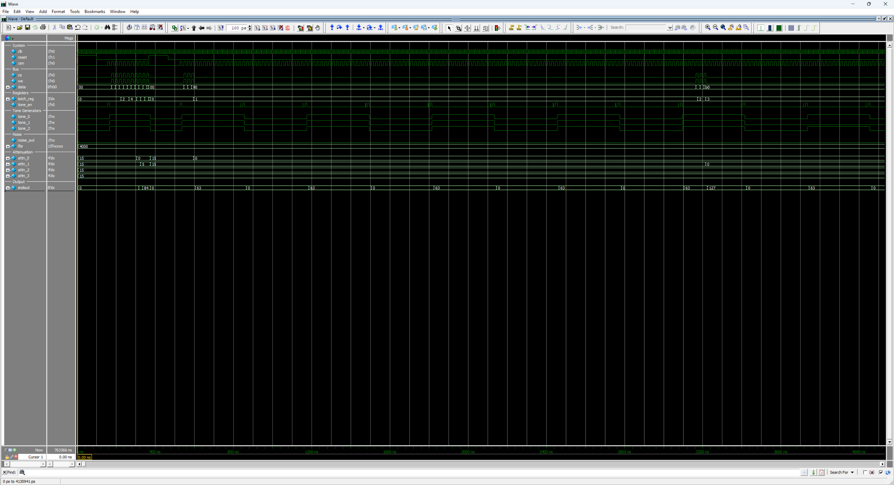
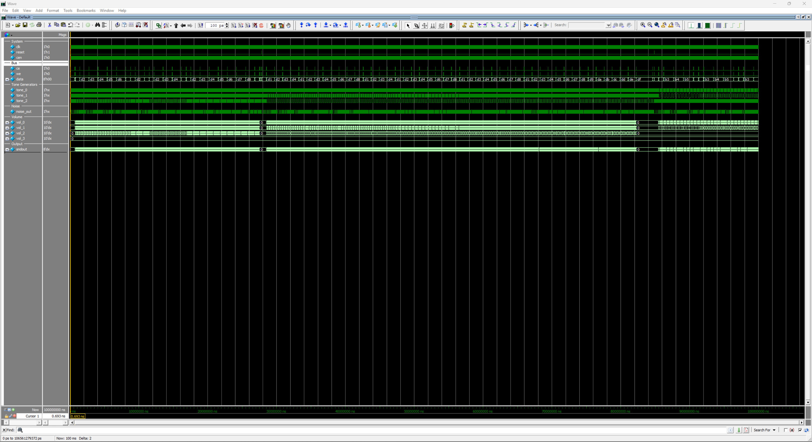

# x76489 - SN76489AN Verilog Implementation

<table align="center">
  <tr>
    <td align="center" style="padding: 10px;">
      
    </td>
  </tr>
</table>

## x76489 Overview

The **x76489** is a fully synchronous Verilog implementation of the Texas Instruments SN76489AN Digital Complex Sound Generator. This implementation provides a functional equivalent of the SN76489AN for FPGA-based applications.

### Features

<small>

- **Fully Synchronous Design**: All state changes occur on the positive edge of `clk` when `cen` is active. No latches or asynchronous logic.
- **Three Tone Channels**: 10-bit period down counters with toggle flip-flop output.
- **White and Periodic Noise**: 15-bit LFSR with configurable feedback taps (bits 0,1).
- **Four Independent Attenuators**: 2dB steps per TI datasheet, 0dB to 28dB plus OFF.
- **Register Compatible**: 8 internal registers with latch/data byte protocol.

</small>

## Table of Contents

| # | Section | Description |
|---|---------|-------------|
| 1 | [System Architecture](#system-architecture) | Top-level block diagram of the control registers, three tone channels, noise generator, attenuators, and master mix |
| 2 | [Module Hierarchy](#module-hierarchy) | Source-file listing with each module's role and approximate line count |
| 3 | [Register Map](#register-map) | R0 R1 R2 register select, latch / data byte format, the 16-step attenuation table, and noise-control field decode |
| 4 | [Internal Clock Division](#internal-clock-division) | Master clock prescaler tree and the per-block tone / noise frequency formulas |
| 5 | [Design Usage](#design-usage) | Instantiation template and the latch / data byte bus protocol |
| 6 | [Design Verification](#design-verification) | Testbench section breakdown, run command, ModelSim screenshot, and final summary box. Per-test log: [tb_x76489](doc/readme/tb_x76489_log.md). |
| 7 | [VGM Playback](#vgm-playback) | Agnostic VGM playback testbench for validating the PSG against captured arcade and console audio, plus the VGZ-to-WAV toolchain |
| 8 | [SN76489 Family Roadmap](#sn76489-family-roadmap) | Position of x76489 within the SN76489AN / SN76494N / SN76496N variant family |
| 9 | [Project Structure](#project-structure) | Directory tree of the IP package |
| 10 | [Design References](#design-references) | Hardware manuals and datasheets used as the implementation reference |
| 11 | [License](#license) | Creative Commons Attribution-NonCommercial 4.0 International |
| 12 | [Support](#support) | Back ongoing Coin-Op Collection FPGA core development on Patreon |

## System Architecture

```
┌─────────────────────────────────────────────────────────────────┐
│                           x76489                                │
│                                                                 │
│  ┌───────────────────┐                                          │
│  │   Control         │   ┌─────────────┐                        │
│  │   Registers       │──>│ x76489_tone │──> Attn 0 ──┐          │
│  │                   │   │  Channel 1  │             │          │
│  │  8 registers      │   ├─────────────┤             │          │
│  │  Latch/Data byte  │──>│ x76489_tone │──> Attn 1 ──┤          │
│  │  protocol         │   │  Channel 2  │             │    Sum   │
│  │                   │   ├─────────────┤             ├──> Out   │
│  │  /16 Clock        │──>│ x76489_tone │──> Attn 2 ──┤          │
│  │  Divider          │   │  Channel 3  │      │      │          │
│  └───────────────────┘   └─────────────┘      │      │          │
│                                               v      │          │
│           ┌──────────────┐                           │          │
│           │ x76489_noise │──────────> Attn 3 ────────┘          │
│           │ 15-bit LFSR  │                                      │
│           └──────────────┘                                      │
│                                                                 │
│           ┌──────────────┐                                      │
│           │ x76489_edge  │  (used by noise generator)           │
│           └──────────────┘                                      │
└─────────────────────────────────────────────────────────────────┘
```

## Module Hierarchy

| Module | Description | Lines |
|--------|-------------|-------|
| `x76489.v` | Top-level PSG (registers, attenuators, output) | ~275 |
| `x76489_tone.v` | Tone generator (10-bit down counter, toggle) | ~60 |
| `x76489_noise.v` | Noise generator (15-bit LFSR, selectable rate) | ~105 |
| `x76489_edge.v` | Single-cycle rising edge detector | ~40 |

## Register Map

| R0 R1 R2 | Register |
|----------|----------|
| 000 | Tone 1 Frequency (10-bit) |
| 001 | Tone 1 Attenuation (4-bit) |
| 010 | Tone 2 Frequency (10-bit) |
| 011 | Tone 2 Attenuation (4-bit) |
| 100 | Tone 3 Frequency (10-bit) |
| 101 | Tone 3 Attenuation (4-bit) |
| 110 | Noise Control (3-bit: FB, NF0, NF1) |
| 111 | Noise Attenuation (4-bit) |

### Data Formats

```
Frequency (double byte):
  First byte:  [1 | R0 R1 R2 | F6 F7 F8 F9]
  Second byte: [0 |  x | F0 F1 F2 F3 F4 F5]

Noise Control (single byte):
  [1 | 1 1 0 | x | FB | NF0 NF1]

Attenuation (single byte):
  [1 | R0 R1 R2 | A0 A1 A2 A3]
```

### Attenuation Table

| Control | Attenuation |
|---------|------------|
| 0000 | 0 dB (full volume) |
| 0001 | -2 dB |
| 0010 | -4 dB |
| 0011 | -6 dB |
| 0100 | -8 dB |
| 0101 | -10 dB |
| 0110 | -12 dB |
| 0111 | -14 dB |
| 1000 | -16 dB |
| 1001 | -18 dB |
| 1010 | -20 dB |
| 1011 | -22 dB |
| 1100 | -24 dB |
| 1101 | -26 dB |
| 1110 | -28 dB (max attenuation) |
| 1111 | OFF |

### Noise Control

| FB | NF0 NF1 | Shift Rate |
|----|---------|-----------|
| 0 | - | Periodic noise (direct feedback) |
| 1 | - | White noise (XOR feedback) |
| - | 00 | N/512 |
| - | 01 | N/1024 |
| - | 10 | N/2048 |
| - | 11 | Tone Generator #3 output |

## Internal Clock Division

```
Master Clock ──> /16 ──> tone_en ──> Tone Counters ──> /2 (toggle) ──> Noise Shift Rate (/32, /64, /128, or Tone 3)
```

- Tone output frequency: `f = clock / (32 * N)` where N = 10-bit register value
- N=0 wraps to 1024, producing the lowest frequency

## Design Usage

### Instantiation Example

```verilog
x76489 u_psg (
    .clk    ( clk_sys   ), // System clock
    .cen    ( psg_cen   ), // Clock enable at PSG master rate (typ 3.579MHz)
    .reset  ( reset     ), // Synchronous reset
    .ce     ( psg_ce    ), // Chip enable
    .we     ( psg_we    ), // Write enable
    .data   ( psg_data  ), // 8-bit data bus
    .sndout ( psg_audio )  // 8-bit unsigned audio output
);
```

## Design Verification

The testbench (`tb_x76489.v`) provides comprehensive verification across 6 sections covering the latch / data register bus, tone and noise generators, attenuators, master mix, and write-while-active behaviour:

<small>

- **Register Protocol**: Latch byte, data byte, all 8 register addresses, reset defaults
- **Tone Generation**: Period configuration, toggle verification, rate comparison
- **Noise Generation**: White and periodic modes, LFSR shift, tone 3 driven, LFSR reset
- **Attenuation**: 2dB steps, OFF state, silence verification
- **Master Output**: Channel summing and isolation (3 tone + noise)
- **Write-While-Active**: Attenuation and frequency changes during playback

</small>

```
vlog tb_x76489.v ../hdl/*.v
vsim -c tb_x76489 -do "run -all"
```

<table align="center">
  <tr>
    <td align="center" style="padding: 10px;">
      
    </td>
  </tr>
</table>

```
=============================================================
  SN76489AN Comprehensive Test Results
=============================================================
  Total Tests:  29
  Passed:       29
  Failed:       0
=============================================================
  *** ALL TESTS PASSED ***
=============================================================
```

Per-test output: [tb_x76489](doc/readme/tb_x76489_log.md)

## VGM Playback

An agnostic VGM playback testbench is included for validating the PSG against real game audio. VGM files contain timestamped SN76489 register writes captured from arcade and console hardware. The testbench replays these writes through the x76489 and captures the audio output as WAV files.

<table align="center">
  <tr>
    <td align="center" style="padding: 10px;">
      
    </td>
  </tr>
</table>

### Usage

1. Place VGZ/VGM files in `sim/output/vgm/`
2. Generate the playlist:
```
cd sim
python scripts/vgm2hex.py
```
3. Run the simulation:
```
vlog tb_x76489_vgm.v ../hdl/*.v
vsim -c tb_x76489_vgm -do "run -all; quit -f"
```
4. Convert to WAV:
```
python scripts/wav_batch.py
```

WAV files are written to `sim/output/wav/` with names derived from the source VGM filenames. The testbench automatically detects the SN76489 clock rate from each VGM file and adjusts timing accordingly.

### Pipeline

| Step | Input | Output |
|------|-------|--------|
| `vgm2hex.py` | VGZ/VGM files | `playlist.hex` + `tracklist.txt` |
| `tb_x76489_vgm.v` | `playlist.hex` | `track_NN.raw` (8-bit PCM at 44100 Hz) |
| `wav_batch.py` | `track_NN.raw` + `tracklist.txt` | Named WAV files |

## SN76489 Family Roadmap

The x76489 core targets the SN76489AN. LFSR taps and prescaler are parameterized for future variant support.

| Feature | SN76489AN (Current) | SN76494N | SN76496N |
|---------|---------------------|----------|----------|
| Clock Prescaler | /16 | /2 | /16 |
| Max Clock | 4 MHz | 500 kHz | 4 MHz |
| LFSR Taps | 0, 1 | 0, 1 | 0, 3 |
| LFSR Width | 15-bit | 15-bit | 15-bit |
| Package | 16-pin DIP | 16-pin DIP | 16-pin DIP |

## Project Structure

```
x76489/
├── doc/
│   ├── 00_SN76489AN_Datasheet.pdf
│   ├── 01_SN76494_SN76496_Datasheet.pdf
│   ├── 02_SN76489_RE_Schematic.png
│   └── 03_SN76489_RE_Schematic_ika.pdf
├── hdl/
│   ├── x76489.v              # Top-level PSG (registers, attenuators, output)
│   ├── x76489_tone.v         # Tone generator
│   ├── x76489_noise.v        # Noise generator
│   └── x76489_edge.v         # Signal edge detector
├── sim/
│   ├── tb_x76489.v           # Comprehensive verification testbench
│   ├── tb_x76489_vgm.v       # VGM playback testbench
│   ├── scripts/
│   │   ├── vgm2hex.py        # VGZ/VGM to hex playlist converter
│   │   └── wav_batch.py      # Raw PCM to WAV batch converter
│   └── output/
│       ├── vgm/              # User-supplied VGZ/VGM files
│       ├── vgm_hex/          # Generated playlist and tracklist
│       └── wav/              # Generated WAV files
└── x76489.qip                # Quartus project include file
```

## Design References

- SN76489AN Datasheet (Texas Instruments)
- SN76494/SN76496 Datasheet (Texas Instruments)
- [SN76489 Reverse Engineered Schematic](https://github.com/emu-russia/SEGAChips/tree/main/VDP/PSG)

## License

This work is licensed under the Creative Commons Attribution-NonCommercial 4.0 International License (CC BY-NC 4.0). You may use, share, and modify this code for non-commercial purposes, provided that proper credit is given. To view a copy of this license, visit **http://creativecommons.org/licenses/by-nc/4.0/**.

## Support

Please consider supporting this and future projects by joining the [**Coin-Op Collection Patreon**](https://www.patreon.com/atrac17).

---
