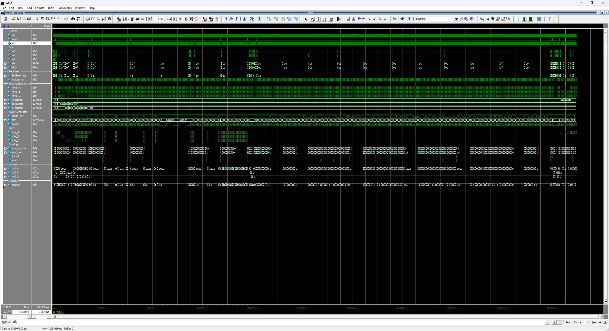
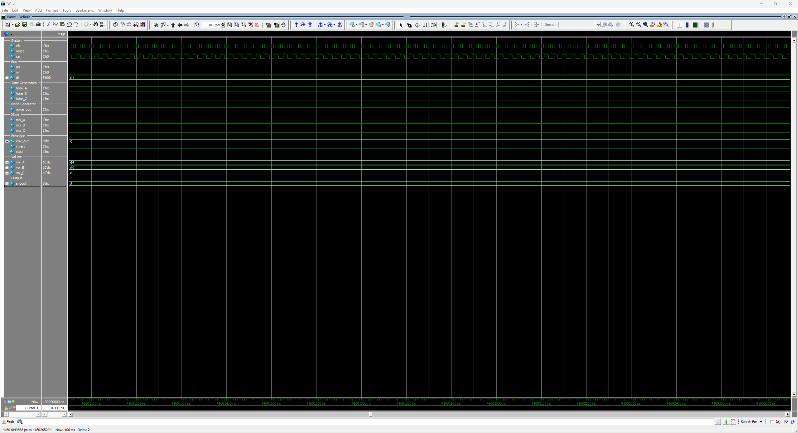

# x8910 - AY-3-8910 Verilog Implementation

<table align="center">
  <tr>
    <td align="center" style="padding: 10px;">
      
    </td>
  </tr>
</table>

## x8910 Overview

The **x8910** is a fully synchronous Verilog implementation of the General Instrument AY-3-8910 Programmable Sound Generator. This implementation provides a functional equivalent of the AY-3-8910 for FPGA-based applications.

### Features

<small>

- **Fully Synchronous Design**: All state changes occur on the positive edge of `clk` when `cen` is active. No latches or asynchronous logic.
- **Three Tone Channels**: 12-bit period square wave generators (A, B, C).
- **Pseudo-Random Noise**: 17-bit LFSR with 5-bit period counter and zero-detect feedback.
- **Envelope Generator**: 16-bit period, 4-bit amplitude counter, 10 shape configurations.
- **Logarithmic D/A**: 10-bit resolution with sqrt(2) voltage steps per GI datasheet.
- **Register Compatible**: 16-register file with proper bit masking on read.

</small>

## Table of Contents

| # | Section | Description |
|---|---------|-------------|
| 1 | [System Architecture](#system-architecture) | Top-level block diagram of the register file, three tone channels, noise generator, envelope, mixer, and DAC |
| 2 | [Module Hierarchy](#module-hierarchy) | Source-file listing with each module's role and approximate line count |
| 3 | [Register Map](#register-map) | R0-R15 layout with detailed bit-field decode for the Mixer Control (R7), Amplitude (R8-R10), and Envelope Shape (R13) registers |
| 4 | [Internal Clock Division](#internal-clock-division) | Master clock divider tree and the per-block tone / noise / envelope frequency formulas |
| 5 | [D/A Converter](#da-converter) | Logarithmic 10-bit volume curve with sqrt(2) voltage steps per GI datasheet |
| 6 | [Design Usage](#design-usage) | Instantiation template and the address-then-data bus write / read protocol |
| 7 | [Design Verification](#design-verification) | Testbench section breakdown, run command, ModelSim screenshot, and final summary box. Per-test log: [tb_x8910](doc/readme/tb_x8910_log.md). |
| 8 | [VGM Playback](#vgm-playback) | Agnostic VGM playback testbench for validating the PSG against captured arcade audio, plus the VGZ-to-WAV toolchain |
| 9 | [Project Structure](#project-structure) | Directory tree of the IP package |
| 10 | [Design References](#design-references) | Hardware manuals and datasheets used as the implementation reference |
| 11 | [License](#license) | Creative Commons Attribution-NonCommercial 4.0 International |
| 12 | [Support](#support) | Back ongoing Coin-Op Collection FPGA core development on Patreon |

## System Architecture

```
┌─────────────────────────────────────────────────────────────────┐
│                            x8910                                │
│                                                                 │
│  ┌───────────────────┐                                          │
│  │   Register File   │   ┌────────────┐                         │
│  │   (R0-R15, 4-bit  │──>│ x8910_tone │──┐                      │
│  │    latch addr)    │   │  Channel A │  │                      │
│  │                   │   ├────────────┤  │   ┌───────────┐      │
│  │  Bus Interface    │──>│ x8910_tone │─────>│           │      │
│  │  (a0/wr/rd)       │   │  Channel B │  │   │   Mixer   │───┐  │
│  │                   │   ├────────────┤  │   │  (3 ch)   │   │  │
│  │  /8 Clock Divider │──>│ x8910_tone │──┘   │           │   │  │
│  │                   │   │  Channel C │  ┌──>│           │   │  │
│  └───────────────────┘   └────────────┘  │   └───────────┘   │  │
│                                          │                   │  │
│           ┌──────────────┐               │   ┌────────────┐  │  │
│           │ x8910_noise  │───────────────┘   │  Channel   │  │  │
│           │ 17-bit LFSR  │                   │  Volume    │<─┘  │
│           └──────────────┘                   │  (DAC)     │     │
│                                              └─────┬──────┘     │
│           ┌──────────────────┐                     │            │
│           │ x8910_envelope   │─────────────────────┘            │
│           │ 16-bit period    │                                  │
│           │ 10 shapes        │            ┌───────────────┐     │
│           └──────────────────┘            │ Master Output │     │
│                                           │ (8-bit sum)   │──>  │
│           ┌──────────────┐                └───────────────┘     │
│           │ x8910_edge   │  (used by noise and envelope)        │
│           └──────────────┘                                      │
└─────────────────────────────────────────────────────────────────┘
```

## Module Hierarchy

| Module | Description | Lines |
|--------|-------------|-------|
| `x8910.v` | Top-level PSG (register file, mixer, DAC, output) | ~290 |
| `x8910_tone.v` | Square wave tone generator (12-bit period) | ~65 |
| `x8910_noise.v` | Pseudo-random noise (17-bit LFSR, 5-bit period) | ~95 |
| `x8910_envelope.v` | Envelope generator (16-bit period, 10 shapes) | ~135 |
| `x8910_edge.v` | Single-cycle rising edge detector | ~40 |

## Register Map

```
R0      Channel A Tone Period Fine   (8-bit)
R1      Channel A Tone Period Coarse (4-bit: [3:0])
R2      Channel B Tone Period Fine   (8-bit)
R3      Channel B Tone Period Coarse (4-bit: [3:0])
R4      Channel C Tone Period Fine   (8-bit)
R5      Channel C Tone Period Coarse (4-bit: [3:0])
R6      Noise Period                 (5-bit: [4:0])
R7      Mixer Control / I/O Enable   (8-bit)
R8      Channel A Amplitude          (5-bit: {M, L3-L0})
R9      Channel B Amplitude          (5-bit: {M, L3-L0})
R10     Channel C Amplitude          (5-bit: {M, L3-L0})
R11     Envelope Period Fine         (8-bit)
R12     Envelope Period Coarse       (8-bit)
R13     Envelope Shape/Cycle         (4-bit: {Continue, Attack, Alternate, Hold})
R14     I/O Port A Data              (not implemented)
R15     I/O Port B Data              (not implemented)
```

### Mixer Control Register (R7)

```
  7   6   5   4   3   2   1   0
┌───┬───┬───┬───┬───┬───┬───┬───┐
│IOB│IOA│ NC│ NB│ NA│ TC│ TB│ TA│
└───┴───┴───┴───┴───┴───┴───┴───┘
         │   │   │   │   │   └── Tone A disable (1=off)
         │   │   │   │   └────── Tone B disable (1=off)
         │   │   │   └────────── Tone C disable (1=off)
         │   │   └────────────── Noise A disable (1=off)
         │   └────────────────── Noise B disable (1=off)
         └────────────────────── Noise C disable (1=off)
```

### Amplitude Control (R8-R10)

```
  7   6   5   4   3   2   1   0
┌───┬───┬───┬───┬───┬───┬───┬───┐
│ - │ - │ - │ M │L3 │L2 │L1 │L0 │
└───┴───┴───┴───┴───┴───┴───┴───┘
              │   └───┴───┴───┴── Fixed amplitude level (0-15)
              └────────────────── Mode: 0=fixed, 1=envelope
```

### Envelope Shapes (R13)

```
Continue Attack Alternate Hold    Shape
   0       0      x       x      \___  (decay, hold at 0)
   0       1      x       x      /___  (attack, hold at 0)
   1       0      0       0      \\\\  (repeating decay)
   1       0      0       1      \___  (single decay, hold at 0)
   1       0      1       0      \/\/  (decay-attack alternating)
   1       0      1       1      \‾‾‾  (single decay, hold at max)
   1       1      0       0      ////  (repeating attack)
   1       1      0       1      /‾‾‾  (single attack, hold at max)
   1       1      1       0      /\/\  (attack-decay alternating)
   1       1      1       1      /___  (single attack, hold at 0)
```

## Internal Clock Division

```
Master Clock ──> /8 ──> master_en ──> Tone Generators ──> /2 (toggle)
                                  ──> Noise Generator ──> /2 (toggle) ──> LFSR
                                  ──> Envelope Generator ──> /2 (toggle) ──> x16 steps
```

- Tone output frequency: `f_T = f_clock / (16 * TP)`
- Noise output frequency: `f_N = f_clock / (16 * NP)`
- Envelope step frequency: `f_E = f_clock / (256 * EP)`

## D/A Converter

Logarithmic volume curve with sqrt(2) steps per GI datasheet (Section 3.7):

| Level | Voltage | dB | 10-bit |
|-------|---------|-----|--------|
| 15 | 1.000V | 0 | 1023 |
| 14 | 0.707V | -3 | 723 |
| 13 | 0.500V | -6 | 512 |
| 12 | 0.354V | -9 | 362 |
| 11 | 0.250V | -12 | 256 |
| 10 | 0.177V | -15 | 181 |
| 9 | 0.125V | -18 | 128 |
| 8 | 0.089V | -21 | 91 |
| 7 | 0.063V | -24 | 64 |
| 6 | 0.044V | -27 | 45 |
| 5 | 0.031V | -30 | 32 |
| 4 | 0.022V | -33 | 23 |
| 3 | 0.016V | -36 | 16 |
| 2 | 0.011V | -39 | 11 |
| 1 | 0.008V | -42 | 8 |
| 0 | OFF | - | 0 |

## Design Usage

### Instantiation Example

```verilog
x8910 u_psg (
    .clk    ( clk_sys   ), // System clock
    .cen    ( psg_cen   ), // Clock enable at PSG input rate
    .reset  ( reset     ), // Synchronous reset
    .a0     ( psg_a0    ), // Address/data select
    .wr     ( psg_wr    ), // Write enable
    .rd     ( psg_rd    ), // Read enable
    .din    ( psg_din   ), // Data bus input
    .dout   ( psg_dout  ), // Data bus output
    .sndout ( psg_audio )  // 8-bit unsigned audio output
);
```

### Bus Protocol

```
Register Write:
  1. Set a0=0, din={4'b0, reg_addr}, wr=1  (latch address)
  2. Set a0=1, din=data, wr=1              (write data)

Register Read:
  1. Set a0=0, din={4'b0, reg_addr}, wr=1  (latch address)
  2. Set a0=0, rd=1                        (read data on dout)
```

## Design Verification

The testbench (`tb_x8910.v`) provides comprehensive verification across 8 sections covering the register bus, tone / noise / envelope generators, mixer, DAC, and write-while-active behaviour:

<small>

- **Register Protocol**: Latch, write, read, and bit masking for all register types
- **Tone Generation**: Period configuration and toggle verification for all 3 channels
- **Noise Generation**: LFSR activity and pseudo-random output verification
- **Mixer Logic**: Tone/noise enable/disable combinations and bypass behavior
- **Amplitude Control**: Fixed levels through logarithmic DAC lookup
- **Envelope Generator**: Shape configuration, hold behavior, and restart
- **Master Output**: Channel summing and output range verification

</small>

```
vlog tb_x8910.v ../hdl/*.v
vsim -c tb_x8910 -do "run -all"
```

<table align="center">
  <tr>
    <td align="center" style="padding: 10px;">
      
    </td>
  </tr>
</table>

```
=============================================================
  AY-3-8910 Comprehensive Test Results
=============================================================
  Total Tests:  59
  Passed:       59
  Failed:       0
=============================================================
  *** ALL TESTS PASSED ***
=============================================================
```

Per-test output: [tb_x8910](doc/readme/tb_x8910_log.md)

## VGM Playback

An agnostic VGM playback testbench is included for validating the PSG against real game audio. VGM files contain timestamped AY-3-8910 register writes captured from arcade hardware. The testbench replays these writes through the x8910 and captures the audio output as WAV files.

<table align="center">
  <tr>
    <td align="center" style="padding: 10px;">
      
    </td>
  </tr>
</table>

### Usage

1. Place VGZ/VGM files in `sim/output/vgm/`
2. Generate the playlist:
```
cd sim
python scripts/vgm2hex.py
```
3. Run the simulation:
```
vlog tb_x8910_vgm.v ../hdl/*.v
vsim -c tb_x8910_vgm -do "run -all; quit -f"
```
4. Convert to WAV:
```
python scripts/wav_batch.py
```

WAV files are written to `sim/output/wav/` with names derived from the source VGM filenames. The testbench automatically detects the AY clock rate from each VGM file and adjusts timing accordingly.

### Pipeline

| Step | Input | Output |
|------|-------|--------|
| `vgm2hex.py` | VGZ/VGM files | `playlist.hex` + `tracklist.txt` |
| `tb_x8910_vgm.v` | `playlist.hex` | `track_NN.raw` (8-bit PCM at 44100 Hz) |
| `wav_batch.py` | `track_NN.raw` + `tracklist.txt` | Named WAV files |

## Project Structure

```
x8910/
├── doc/
│   ├── 00_GI_AY-3-8910_Datasheet.pdf
│   ├── 01_AY-3-8910_8912_Programmable_Sound_Generator_Data_Manual.pdf
│   └── 02_AY-3-8910_RE_Schematic.pdf
├── hdl/
│   ├── x8910.v               # Top-level PSG (registers, mixer, DAC)
│   ├── x8910_tone.v          # Tone generator
│   ├── x8910_noise.v         # Noise generator
│   ├── x8910_envelope.v      # Envelope generator
│   └── x8910_edge.v          # Signal edge detector
├── sim/
│   ├── tb_x8910.v            # Comprehensive verification testbench
│   ├── tb_x8910_vgm.v        # VGM playback testbench
│   ├── scripts/
│   │   ├── vgm2hex.py        # VGZ/VGM to hex playlist converter
│   │   └── wav_batch.py      # Raw PCM to WAV batch converter
│   └── output/
│       ├── vgm/              # User-supplied VGZ/VGM files
│       ├── vgm_hex/          # Generated playlist and tracklist
│       └── wav/              # Generated WAV files
└── x8910.qip                 # Quartus project include file
```

## Design References

- GI AY-3-8910 Datasheet (General Instrument)
- AY-3-8910/8912 Programmable Sound Generator Data Manual (General Instrument, Feb 1979)
- [AY-3-8910 Reverse Engineered Schematic](https://github.com/lvd2/ay-3-8910_reverse_engineered/tree/master/sch)

## License

This work is licensed under the Creative Commons Attribution-NonCommercial 4.0 International License (CC BY-NC 4.0). You may use, share, and modify this code for non-commercial purposes, provided that proper credit is given. To view a copy of this license, visit **http://creativecommons.org/licenses/by-nc/4.0/**.

## Support

Please consider supporting this and future projects by joining the [**Coin-Op Collection Patreon**](https://www.patreon.com/atrac17).

---
